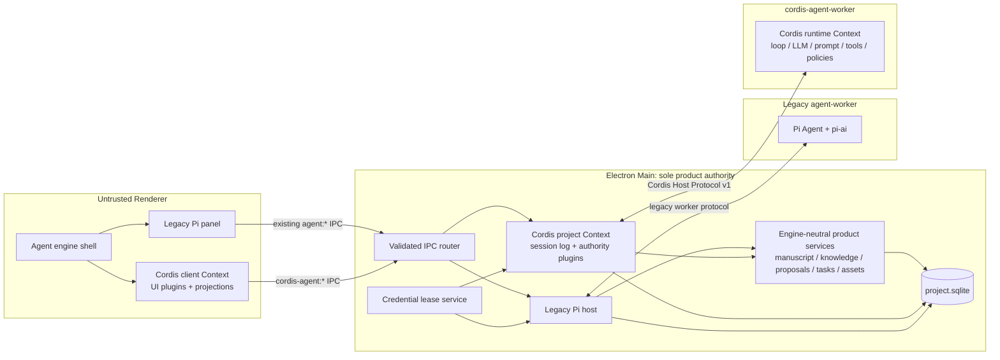

# WriteLLM Cordis Agent Target Architecture

Status: proposed; implementation is not authorized until ADR 045 is accepted  
Date: 2026-08-14  
Branch: `cordis-reform`  
Research basis: [Cordis and DeepSeek Harness source study](../audits/2026-08-14-cordis-and-deepseek-harness-prestudy.md)

## 1. Executive decision

WriteLLM will build a new Cordis-based Agent Harness as a greenfield, experience-oriented Agent
platform. Cordis is the composition substrate, not the product objective by itself. The objective
is to make model-visible context, tools, policies, diagnostics, and UI surfaces independently
extensible, safely reloadable, and explainable to the user. During transition,
the existing Pi Agent and the new Cordis Agent will coexist as two isolated engines that can be
selected from the application shell. They will not share a loop, session protocol, worker
protocol, event schema, prompt builder, compaction logic, runtime state, or Renderer feature
implementation.

The transition is not a compatibility migration:

- a Pi session always remains a Pi session;
- a Cordis session always remains a Cordis session;
- there is no Pi-to-Cordis event converter;
- there is no shared Harness facade that normalizes both event streams;
- there is no dual write between the two session stores;
- a running or persisted session cannot change engine;
- feature completion is proved independently in the Cordis engine;
- the final state deletes the Pi runtime, its dependency packages, worker, IPC, UI, and legacy
  session data surface.

Both engines may call the same Main-owned product services for manuscript, knowledge, proposals,
review issues, writing tasks, assets, credentials, and audit. Those services are not part of either
Harness. They are the single product authority that must remain unique regardless of which client
initiates a request.

## 2. Fixed constraints

The following constraints are already decided by the user and are not alternatives in this
proposal:

1. The target Agent runtime is based on Cordis.
2. The Cordis Agent is a new implementation, not a wrapper around Pi.
3. Pi and Cordis must not overlap at the Harness/runtime level.
4. The application must allow the user to select either engine during the transition.
5. Sessions never move between engines.
6. The long-term target removes `@earendil-works/pi-agent-core` and
   `@earendil-works/pi-ai` completely.
7. No arbitrary third-party, marketplace, or model-authored code plugin surface is introduced by
   this reform.
8. The Renderer remains untrusted; Cordis does not weaken Electron process and IPC boundaries.
9. Main remains the only project database, manuscript mutation, project filesystem, credential,
   approval-decision, and durable-job authority.
10. Existing product capabilities are reimplemented for Cordis, not silently dropped to make the
    replacement easier.

## 3. Goals and non-goals

### 3.1 Goals

- Make every Cordis Agent capability a lifecycle-owned plugin or service provider.
- Separate service contracts from providers, model-facing tools, policies, and UI contributions.
- Give prompt, trusted context, tool, policy, presentation, projection, and diagnostics plugins
  explicit contribution contracts instead of unconstrained event hooks.
- Support safe live reload of trusted built-in composition and file-backed prompt/context content,
  with candidate validation, last-good rollback, and visible failure diagnostics.
- Keep durable Agent facts separate from live Cordis events.
- Make the exact model-visible request reconstructable from project-local persisted data.
- Provide a local request trajectory and span trace that explains prompt contributors, tool-schema
  changes, policy decisions, provider attempts, time-to-first-token, tool execution, Main authority,
  and persistence latency.
- Make plugin state, dependency waits, reload generation, failure, and teardown observable from a
  read-only diagnostics surface.
- Make project, session, agent, and run scopes explicit and disposable.
- Support provider replacement without coupling the Agent loop to provider SDKs.
- Keep every model-facing project action behind a typed Main authority bridge.
- Preserve all twenty current WriteLLM model-facing tools and their bounded semantics.
- Preserve title generation, model/thinking selection, approval modes, queue/steer/follow-up,
  compaction, task correlation, activity projection, interruption, recovery, and proposal review.
- Permit a clean, evidence-gated deletion of the Pi implementation.

### 3.2 Non-goals

- Importing DeepSeek Harness as the WriteLLM product architecture.
- Recreating all DeepSeek Harness packages or generic coding-agent tools.
- Exposing shell, arbitrary filesystem, generic network, process, MCP, or dynamic-code tools.
- Converting old Pi conversations into runnable Cordis conversations.
- Sharing one Renderer transcript model between engines.
- Hot-loading arbitrary npm packages or accepting arbitrary module specifiers from user config.
- Treating production configuration reload and developer code HMR as the same trust surface.
- Plan mode and subagent capabilities. Directional clarification uses structured questions and
  ordinary conversation; orchestration stays single-agent. Either may be revisited only through a
  new ADR.
- Exporting prompts, messages, manuscripts, or tool bodies to telemetry by default.
- Treating Cordis isolate realms as a security sandbox.
- Replacing manuscript, knowledge, indexing, export, asset, or publication subsystems with Cordis.

### 3.3 Reserved seams for deferred extension stages

Two capabilities are accepted in principle but implemented only as separately authorized stages
after parity. The substrate reserves exactly these joints and nothing more:

- **Goals.** A durable objective with a verifier and a bounded round driver hooks the existing
  `agent/turn-stopping` serial event. Verifiers reuse the deterministic draft-check authority
  first (style and wording lints such as AI phrasing habits); model-based review is a later
  verifier class. Every round still passes proposal and approval policy, rounds and token spend
  are capped, and progress is visible and interruptible. A goal defines objective, verifier, and
  round limits; execution decomposition keeps using Writing Tasks. Reserved now: the
  `writellm.goals` service key and a durable `goal/*` event family. Reference implementation
  shape (dsh): a round driver listening on agent-idle status with a serial per-agent driver
  state, round messages carrying exact `{goalId, revision, round}` reservations re-validated at
  `agent/pre-step`, CAS on `{id, revision}`, and a `round-limit` block when the budget
  exhausts; goal-tool execution requires provable in-turn human input or an exact matching
  goal round.
- **Structured user questions.** Agent-initiated clarification with options shares the interactive
  pause/resume machinery with approval but uses its own `question/*` durable event family and
  carries no policy-tightening semantics. An answer commits as source-attributed model-visible
  input so request reconstruction stays honest. A prompt policy asks only when the answer changes
  the next action. Reserved now: the `writellm.userQuestions` service key, the `question/*`
  family, and the R6 requirement that pause/resume machinery is card-type generic. Reference
  implementation shape (dsh): a single UI provider behind the service
  (`registerProvider({ask})`), validated question items with labelled options and an optional
  free-text channel, and a model-facing bridge tool (`ask_user_question`) whose tool call
  suspends until the provider answers.

## 4. Separation contract

### 4.1 Allowed shared platform

The following capabilities are application infrastructure or product authority and may be consumed
by both engines through independent adapters:

- project-session capability validation;
- project database transaction service;
- manuscript snapshot/read/search services;
- knowledge search and citation services;
- Writing Skill catalog and virtual-URI reader;
- deterministic draft checks;
- engine-neutral writing change proposal authority;
- Review Issue and Writing Task authority;
- manuscript asset and image-generation job authority;
- provider catalog and credential lease service;
- model-request accounting and cost/usage audit;
- structured observability and correlation IDs;
- engine-neutral run concurrency and cost ceilings, applied across both engines rather than per
  engine;
- application clocks, IDs, Zod schemas, and safe error vocabulary;
- shadcn UI primitives and product visual tokens.

These shared services contain no Agent loop, prompt policy, conversation event, tool scheduling, or
engine lifecycle behavior.

### 4.2 Forbidden runtime overlap

The following must remain engine-private:

| Boundary | Pi legacy | Cordis target |
| --- | --- | --- |
| Utility process | existing `agent-worker` | new `cordis-agent-worker` |
| Session store | `agent_sessions` / `agent_runs` / `agent_events` | `cordis_sessions` / `cordis_events` / Cordis payload tables |
| Worker protocol | existing Agent Harness Protocol v6 messages | new Cordis Host Protocol v1 |
| Loop | Pi Agent runtime | `writellm.agentLoop` provider plugin |
| LLM runtime | `pi-ai` | new `writellm.llm` providers with no Pi imports |
| Prompt assembly | current Main prompt builder | Cordis `system-prompt/assemble` pipeline |
| Tool registry | Pi `AgentTool[]` | Cordis `writellm.tools` service |
| Live events | Pi subscription events | typed Cordis events |
| Compaction | current checkpoint implementation | Cordis compaction provider and durable events |
| Queue/steer | current session service state | Cordis inbox/queue service |
| Renderer | existing Agent panel and hooks | separate Cordis client context and panel |
| IPC namespace | existing `agent:*` | new `cordis-agent:*` |

Forbidden dependencies are enforced mechanically:

- no file under the Cordis Agent roots may import from the legacy Agent roots;
- no Cordis Agent file may import `@earendil-works/pi-agent-core` or
  `@earendil-works/pi-ai`;
- no legacy Agent file may import a Cordis runtime module;
- the engine selector may import only each engine's opaque Renderer entry component and tagged
  session summary type;
- neither engine may query the other engine's session tables;
- a bridge may not translate one engine's events into the other engine's events.

### 4.3 Engine identity and switching

The application-level engine identifiers are:

```ts
type AgentEngineId = 'pi-legacy' | 'cordis'
```

Engine choice follows these rules:

- the app setting `agent.defaultEngine` controls only new-session creation;
- a session handle is always tagged `{ engine, sessionId }`;
- selecting another engine changes the visible engine feature, not the current session's runtime;
- an active Pi run may finish while the user views Cordis, and vice versa;
- starting work in the other engine means selecting or creating a session owned by that engine;
- session IDs are never accepted without their engine tag at the application shell;
- the Pi panel and Cordis panel subscribe independently and never share an event cache.

## 5. Cordis source and boot policy

### 5.1 Framework source

The initial implementation will pin exact `@deepseek-ai/cordis@4.0.1` plus the composition packages
from the same fixed DeepSeek Harness source snapshot:

- `@deepseek-ai/cordis-plugin-loader@1.0.2`;
- `@deepseek-ai/cordis-plugin-include@1.0.6`;
- `@deepseek-ai/cordis-plugin-group@1.0.1`;
- `@deepseek-ai/cordis-plugin-hmr@1.0.16`.

All five versions were verified as published on 2026-08-14 and match the manifests in the studied
DeepSeek Harness commit. This line is selected over upstream `cordis@4.0.0-rc.8` because the Harness
depends on additional lifecycle and transactional reload hardening that is not equivalent to the
upstream RC.

The dependency policy is:

- exact version, never a range;
- lockfile integrity checked in review and packaged artifacts;
- MIT license and published source retained in dependency inventory, including the transitive
  `@deepseek-ai/cosmokit` dependency;
- the npm artifacts' provenance is the DeepSeek Harness repository release process; if a product
  fix ever requires patching the framework, the escalation path is pnpm `patchedDependencies`
  first and vendoring second, each recorded in the dependency inventory with a source diff;
- a WriteLLM conformance suite freezes every Cordis behavior the Harness relies on;
- upgrades are separate architecture-maintenance changes with source diff and conformance evidence;
- no WriteLLM code imports DeepSeek Harness Agent packages; only the Cordis framework is adopted.

### 5.2 Trusted composition and reload

The target uses Cordis Loader composition for trusted built-in entries, but WriteLLM owns resolution
and product policy. A configuration row identifies a stable catalog ID, never an arbitrary npm or
filesystem module specifier. The catalog maps that ID to a statically bundled, versioned plugin and
its closed Zod configuration schema.

The production composition layer supports:

- stable entry IDs, enablement, configuration, groups, and scoped service isolation;
- built-in profile and project override layers with a deterministic precedence order;
- file-backed prompt, instruction, and Writing Skill content refresh;
- trusted built-in plugin enable/disable/reconfigure without application restart;
- candidate parse, schema validation, activation settlement, commit, and last-good rollback;
- serialized/coalesced refresh when several file events arrive during one update;
- a monotonically increasing `compositionRevision`, content hash, and per-entry configuration hash;
- an activation audit that reports unexpected `PENDING`, `FAILED`, or missing Fibers visibly.

Composition is per process. Main, the Cordis worker, and the Renderer each own an independent
composition with its own catalog and revision. The Renderer runs only the Cordis core runtime: no
Loader, Include, Group, or HMR package enters its bundle, its UI composition is fixed at build
time, and runtime control is limited to enable/disable projection. Production configuration in any
process resolves stable catalog IDs with closed schemas, and `!!js` expression evaluation is
disabled in production configuration. The `compositionRevision` recorded in a request snapshot is
the revision of the worker runtime composition that assembled that request; Main and Renderer
revisions are diagnostics, not request authority.

WriteLLM will rely only on Loader/Include/Group/HMR behavior covered by its conformance suite. The
DeepSeek Harness fork is instructive here: entry updates restore the previous plugin/config after a
failed apply; group updates await concurrent candidates and roll back additions and changes; include
refresh parses a detached candidate and commits its cache only after the child tree settles; config
watchers serialize and coalesce refreshes and drain outstanding work on disposal. These behaviors are
product requirements, not incidental implementation details.

Reload has four distinct trust levels:

| Reload class | Production policy |
| --- | --- |
| Prompt/instruction/skill content | supported after validation; affects the next request step |
| Built-in plugin configuration and enablement | supported through the allowlisted catalog and transactional composition |
| JavaScript/TypeScript module HMR | development builds only |
| External package install/update or model-authored code | excluded pending a separate trust, signing, permission, and recovery ADR |

An in-flight model request uses one frozen composition snapshot. A successful reload becomes visible
only to the next request assembly or newly created operation; it never mutates the prompt, tools, or
policies of a request already sent. The old Fiber tree remains responsible for its in-flight effects
until they reach quiescence, then disposes. A failed candidate leaves the last-good generation active
and produces a sanitized, actionable diagnostic.

### 5.3 Plugin identity

Cordis service keys use the `writellm.*` namespace because Cordis keys are flat:

```text
writellm.agentRegistry
writellm.agentLoop
writellm.sessions
writellm.sessionLog
writellm.llm
writellm.systemPrompt
writellm.tools
writellm.toolAuthority
writellm.approval
...
```

Plugin names use slash-separated stable IDs such as `writellm/tools/section-read`. Package and
file names are not treated as runtime identity.

### 5.4 Extension contract taxonomy

“Plugin” means a Cordis lifecycle unit, not necessarily an installable package. A product feature may
contain several plugins, and one plugin may contribute through more than one typed surface. The
stable extension contracts are:

| Surface | Examples | Owner contract |
| --- | --- | --- |
| Service definition/provider | LLM, persistence, token meter, proposal authority | provider is replaceable; consumer imports only definition |
| Prompt/context contribution | writing policy, current task, project snapshot | named, scoped, ordered, revisioned, source-attributed |
| Tool definition | read section, submit change | schema, execute contract, source plugin, replay presentation |
| Policy middleware | approval, timeout, result bound, retry | fixed event mode; safety decisions are monotonic |
| Durable event definition/projection | session event validator, activity, trajectory | pure replay from canonical facts |
| UI contribution | conversation tab, tool card, settings/diagnostics tab | named slot with effect-owned registration |
| Diagnostics contribution | invariant companion, trace processor, redactor | cannot become recovery authority or weaken privacy |

Each contract publishes its ordering, scope, ownership, error, reload, and disposal semantics. This
prevents a generic hook bus from becoming the de facto architecture and lets future trusted or
external extensions target stable capabilities without importing the Agent loop. Opening those
contracts to third-party packages remains a separate security and distribution decision.

## 6. Process topology



There is no direct Renderer-to-worker channel and no direct worker database access.

The utility-process topology is retained deliberately: it isolates provider streaming and retries
from Main, contains runtime crashes, and narrows the credential surface to one bridge call. The
cost is that the Cordis Host Protocol v1 becomes the engine's axis — every durable event append,
authoritative tool execution, approval round-trip, and request snapshot crosses it — so its design
and property tests are treated as a first-class workstream. Because Main commits the request
snapshot before provider network I/O, every model request includes one worker→Main→SQLite→ack
round-trip; this is accepted at desktop latency and surfaced explicitly in timing diagnostics.

## 7. Cordis context hierarchy

### 7.1 Main process

```text
main application root Context
  -> project Context (one per active projectSessionId capability epoch)
       -> Cordis session Context (only while a Cordis session is live)
            -> run Context (one per active run)
```

- The application root owns logging, clock, boot diagnostics, IPC registration, and worker client.
- The project Context isolates persistence and product-authority providers for one revocable
  `projectSessionId`.
- The session Context owns live projection, approval routing, subscriptions, and the corresponding
  worker session lease.
- The run Context owns operation correlation, cancellation, request-scoped credential leases, and
  pending Main tool calls.

Disposing the project Context must revoke all session and run capabilities before closing the
project database.

### 7.2 Cordis Agent utility process

```text
worker root Context
  -> project runtime realm
       -> Agent/session Context
            -> run/turn Context
                 -> step dispatch context
```

- The worker root owns only process-safe runtime services and the typed Main bridge.
- Project realms never receive an absolute project path or database handle.
- An Agent/session Context owns the live registry, prompt contributions, tool restrictions,
  compaction state, queue state, and session replica.
- A run/turn Context owns cancellation, resolved model route, request limits, and correlation.
- Step identity travels through event dispatch metadata; a new service realm is created only when
  provider isolation is required.

### 7.3 Renderer

```text
Cordis Agent client root Context
  -> project view Context
       -> session view Context
```

The Renderer context contains only sanitized session query, subscription, command, locale, and UI
contribution services. It does not receive Node.js, filesystem, database, credential, raw MessagePort,
or unrestricted IPC services. Only the Cordis core runtime is bundled here: Loader, Include, Group,
and HMR never enter the Renderer, its plugin composition is fixed at build time, and runtime control
is limited to enable/disable projection (see section 5.2).

### 7.4 Isolate and intercept usage

Use isolate realms for providers whose identity must not leak across project or session boundaries:

- `writellm.sessions`;
- `writellm.sessionLog`;
- `writellm.toolAuthority`;
- `writellm.approval`;
- `writellm.providerLease`;
- `writellm.clientProjection`.

Use intercept metadata for per-call facts that do not change provider identity:

- `operationId`;
- `requestId`;
- `projectSessionId` capability epoch;
- Cordis session, run, turn, step, call, task, and job IDs;
- safe actor and source classification.

Never place credentials, prompts, manuscript bodies, absolute paths, or tool results in intercept
metadata or logs.

## 8. Stable service seams

### 8.1 Worker seams

| Service key | Contract responsibility | Initial provider |
| --- | --- | --- |
| `writellm.agentRegistry` | create/dispose live Agent instances and agent scopes | in-process registry plugin |
| `writellm.agentLoop` | turn/step loop and stopping behavior | default WriteLLM loop plugin |
| `writellm.composition` | trusted catalog, generation, transactional reload, and inventory | Loader-backed composition plugin |
| `writellm.sessions` | live session objects and reconstruction | remote-backed session plugin |
| `writellm.sessionLog` | append/replay committed durable events | Main bridge provider |
| `writellm.llm` | provider-neutral prepared stream calls | adapter registry plugin |
| `writellm.systemPrompt` | ordered prompt sections and exact assembly | prompt registry plugin |
| `writellm.contextContributions` | durable model-visible context snapshots | scoped contribution registry |
| `writellm.tools` | tool registry, schemas, execution, result normalization | tool runtime plugin |
| `writellm.toolAuthority` | typed Main tool RPC | Main bridge provider |
| `writellm.tokenMeter` | exact/estimated token accounting | provider-aware meter |
| `writellm.compaction` | checkpoint planning and summary requests | bounded compaction plugin |
| `writellm.inbox` | steer and follow-up queue | per-agent inbox plugin |
| `writellm.providerLease` | resolved route and request-scoped secret access | Main bridge provider |
| `writellm.outboundHttp` | endpoint-bound provider transport | controlled transport plugin |
| `writellm.runtimeContext` | trusted context snapshots and correlation | project/run bridge provider |
| `writellm.requestTrace` | local span lifecycle, correlation, retention, and query | process-local trace provider |
| `writellm.invariants` | optional executable runtime-contract checks | diagnostics registry plugin |

### 8.2 Main seams

| Service key | Contract responsibility |
| --- | --- |
| `writellm.cordisSessionStore` | Cordis session identity, settings, archive state, event sequence |
| `writellm.cordisPayloadStore` | content-addressed private request/event payloads |
| `writellm.cordisRequestStore` | reconstructable request snapshots and model audit |
| `writellm.writingContext` | immutable bounded writing snapshots |
| `writellm.manuscriptRead` | outline, section, manuscript search |
| `writellm.knowledge` | bounded knowledge search and citation reads |
| `writellm.writingSkills` | selection and virtual-URI reads |
| `writellm.draftChecks` | deterministic checks over immutable snapshots |
| `writellm.changeProposals` | engine-neutral proposal create/decide/apply/undo/refresh |
| `writellm.reviewIssues` | bounded durable review issue authority |
| `writellm.writingTasks` | bounded conversation task/step authority |
| `writellm.imageGeneration` | request-scoped image job and asset publication |
| `writellm.approval` | current policy and interactive decision routing |
| `writellm.clientProjection` | Renderer-safe session/activity/proposal views |
| `writellm.requestTraceStore` | bounded local debug trace persistence and query |

The service-definition module for each seam must not import its provider implementation.

## 9. Durable protocol

### 9.1 Authority split

Cordis events are live composition points. They are never recovery state. Durable facts are appended
to project SQLite by Main before downstream behavior treats them as committed.

The worker may propose an event, but Main assigns:

- event ID;
- monotonically increasing per-session sequence;
- commit timestamp;
- payload reference and hash;
- schema version.

The worker continues only after Main acknowledges the commit for facts that affect the model-visible
surface or external authority.

### 9.2 Event families

Cordis Agent Event Protocol v1 contains at least:

| Family | Events |
| --- | --- |
| Session | `session/created`, `session/settings`, `session/archived`, `session/restored` |
| Run/turn | `run/started`, `turn/start`, `turn/end`, `run/completed`, `run/failed`, `run/aborted` |
| Step | `step/start`, `request/header`, `step/end` |
| Messages | `user/message`, `assistant/chunk`, `assistant/message` |
| Tools | `tool/call`, `tool/result` |
| Approval | `approval/asked`, `approval/decided`, `approval/policy` |
| Queue | `inbox/enqueued`, `inbox/steered`, `inbox/consumed`, `inbox/deleted`, `inbox/expired` |
| Context | `context/checkpoint-started`, `context/checkpoint`, `context/checkpoint-failed` |
| Skill/task | `skill/selected`, `writing-task/correlation` |
| Recovery | `recovery/interrupted-run`, `recovery/expired-inbox`, `recovery/repaired-tail` |

Payload schemas are closed Zod objects with explicit byte limits and versioned discriminants.
Unknown non-ignorable event types fail reconstruction rather than being skipped.

### 9.3 Reconstructable requests

Every model request must be reconstructable from persisted project-local data without credentials or
provider SDK state. Before network I/O, Main commits:

- exact ordered messages;
- exact assembled system prompt;
- exact model-facing tool schemas;
- provider/model/protocol selection;
- thinking, temperature, output, stop, and context limits;
- context checkpoint and source event references;
- the worker runtime composition revision that assembled the request, plus the ordered
  prompt/context/tool contributor manifest;
- hashes and schema versions.

Large private bodies are stored in `cordis_payloads`; `request/header` references the immutable
request snapshot and its SHA-256. Credentials, authorization headers, cookies, signed URLs, and
private absolute paths are never persisted.

`assistant/chunk` events are committed before Renderer publication. Physical batching or packing is
allowed only if logical event sequence, timestamps, and exact reconstruction remain lossless.

### 9.4 Tool commit order

```text
model tool call
  -> commit tool/call
  -> tools/pre-execute waterfall
  -> registered monotonic guards
  -> tools/execute waterfall
  -> Main tool authority RPC
  -> tools/post-execute waterfall
  -> normalize and validate result
  -> commit tool/result
  -> emit live tools/result
  -> Renderer projection
```

No mutation or external job may become authoritative before its `tool/call` and source model request
are durable. A proposal tool returns only after the product proposal row and corresponding Cordis
event references are committed consistently.

## 10. Live event contract

The initial public Cordis event surface is intentionally small:

| Event | Mode | Purpose |
| --- | --- | --- |
| `agent/pre-step` | waterfall | claim inbox input and assemble trusted step context |
| `agent/request` | waterfall | propose immutable request settings before preparation |
| `agent/turn-stopping` | serial | allow one ordered stopping extension |
| `agent/status` | emit | observe live state after transition |
| `composition/committed` | emit | publish the new trusted composition revision after settlement |
| `composition/reload-failed` | parallel | report failed candidate stage while last-good remains active |
| `system-prompt/assemble` | waterfall | ordered prompt-section assembly |
| `system-prompt/change` | emit | invalidate request assembly cache |
| `llm/stream` | waterfall | tracing, retry policy, and provider dispatch |
| `tools/pre-execute` | waterfall | allow/deny/ask and argument policy |
| `tools/execute` | waterfall | timeout, metrics, tracing, dispatch |
| `tools/post-execute` | waterfall | inspect, constrain, enrich, or block result |
| `tools/result` | emit | observe immutable final result |
| `tools/change` | emit | invalidate schema/prompt projections |
| `session/committed` | emit | update local replica after Main commit |
| `session/flush` | parallel | await independent persistence/telemetry flushes |

Event mode, ordering, bail conditions, error containment, and scope filtering are contract-tested.
Plugin authors cannot choose another dispatch mode for the same event name. The `question/*` and
`goal/*` families are reserved for the deferred extension stages in section 3.3 and are not part
of the initial surface.

## 11. Persistence model

### 11.1 Cordis-private tables

The new engine uses a separate schema:

- `cordis_sessions` — identity, title, status, schema/runtime version, settings, timestamps;
- `cordis_events` — append-only event metadata and bounded inline payload/reference;
- `cordis_payloads` — content-addressed private large payloads with kind, hash, size, schema;
- `cordis_request_snapshots` — exact request envelope references and fingerprints;
- `cordis_session_projections` — explicitly rebuildable current read model;
- `cordis_projection_cursors` — rebuildable projection progress.

There is no Cordis foreign key to `agent_sessions`, `agent_runs`, or `agent_events`.

Runs, turns, steps, queue state, compaction state, and messages are authoritative in the Cordis event
log. Projection tables may accelerate queries but are deleted and rebuilt in recovery tests.

### 11.2 Engine-neutral product tables

The current schema incorrectly makes product collaboration authority Pi-specific. Before Cordis
write tools are enabled, a forward migration must generalize these product records:

- `mutation_proposals` becomes engine-neutral `writing_change_proposals`;
- `agent_writing_tasks` becomes engine-neutral `writing_tasks`;
- proposal/session/run references in Review Issues become tagged engine origins;
- Agent origin fields on section revisions and manuscript assets gain an engine discriminator;
- `model_requests` records runtime engine and generic session/run origin without a Pi session FK;
- asset-variant proposal references target the engine-neutral proposal authority.

An origin is a closed structure:

```ts
interface AgentOrigin {
  engine: 'pi-legacy' | 'cordis'
  sessionId: string
  runId: string
  toolCallId?: string
}
```

This migration preserves current proposal/task/review/asset data and tags it `pi-legacy`. It does not
copy, convert, or reinterpret Pi session events. After the migration, both engines call the same
Main services with their own `AgentOrigin`; the services never query an engine's session history.

### 11.3 Transaction boundaries

Database transactions contain only local SQLite work. Network calls, LLM streams, image generation,
and worker waits remain outside transactions.

For proposal decisions, the product authority transaction owns:

- optimistic source-version verification;
- proposal status transition;
- revision/brief/outline/asset result;
- undo/refresh lineage;
- durable engine callback event or recovery receipt.

If an engine event cannot be appended in the same transaction, a durable outbox row is committed in
that transaction and drained idempotently. Logs are never used as the outbox.

## 12. Cordis Host Protocol v1

The Main/worker boundary is a new Zod-validated MessagePort protocol. It does not reuse the Pi worker
request or event types.

Every envelope includes:

- protocol version;
- request/message kind;
- request ID;
- operation ID;
- W3C-compatible trace ID, parent span ID, and trace flags for local correlation;
- project ID safe identifier;
- active `projectSessionId` capability and epoch;
- Cordis session and optional run/turn/step/call IDs;
- bounded typed payload.

Main-to-worker commands include boot project realm, open/close session, start run, steer, enqueue,
delete pending input, abort, compact, update session settings, and dispose project.

Worker-to-Main requests include append durable event, load event page, store request snapshot, begin
or complete model audit, execute authoritative tool, request approval, and flush. Worker live deltas
are advisory until their corresponding durable event is acknowledged.

Protocol invariants:

- sender role is authenticated when the MessagePort is installed;
- every project-scoped message revalidates the current capability epoch;
- request IDs are single-use and responses are correlated exactly once;
- cancellation is explicit and linked in both directions;
- timeouts do not abandon in-process work; the owner reaches quiescence before disposal;
- late messages from a revoked project or disposed run are rejected and logged safely;
- original errors are logged with correlation before sanitized transport errors are returned;
- payloads never contain absolute project paths or plaintext credentials except the narrowly scoped
  provider lease delivered directly to the trusted LLM adapter call.

## 13. LLM architecture without Pi

The Cordis engine defines its own immutable provider-neutral request, stream chunk, message, usage,
tool schema, and tool-call types. These types contain no `pi-ai` values.

Provider adapters are Cordis plugins registered with `writellm.llm`. The initial adapter program must
cover every protocol still advertised by WriteLLM's Agent provider catalog before Cordis becomes the
default. The current families are:

- OpenAI chat completions;
- OpenAI Responses and Codex Responses;
- Azure OpenAI Responses;
- Anthropic Messages;
- Google Generative AI and Vertex;
- Mistral Conversations;
- Bedrock Converse Stream;
- any retained `pi-messages` wire protocol through a new non-Pi implementation, or its removal by a
  separate product decision.

Adapters may use the existing AI SDK/provider packages or narrowly scoped protocol clients, but:

- the loop imports only `writellm.llm` contracts;
- adapter packages do not own provider configuration or credentials;
- every stream is normalized before reaching the loop;
- the controlled transport owns endpoint validation, headers, abort, retry classification, and safe
  diagnostics;
- a provider switch takes effect between steps, never inside an in-flight request;
- an unsupported configured protocol fails before a run starts and cannot silently fall back to Pi.

## 14. Prompt and context plugins

Prompt injection is not an unconstrained callback that appends text. WriteLLM exposes separate,
typed contribution surfaces:

| Contribution | Model-visible role | Durable/debug behavior |
| --- | --- | --- |
| Prompt section | stable instructions and policy | named, ordered, scoped, hashed in the request header |
| Runtime context snapshot | time-sensitive facts or selected project state | appended as a source-attributed durable message before request assembly |
| Prompt variable | small typed values used by a section | resolved under the same frozen composition snapshot |
| Tool schema provider | model-visible tool names and schemas | exact ordered schemas persisted in the request snapshot |
| Complete prompt provider | deliberate full replacement for a specialized mode | exclusive and explicitly identified; ordinary plugins cannot silently replace the prompt |

Each registration has a stable contributor ID, owner plugin ID, order, scope, revision, sensitivity
class, and disposer. Within one scope, a more specific registration may shadow a global contributor
only by the same stable name. Ordering is deterministic and stable. Duplicate exclusive providers,
invalid ordering, unresolved variables, or oversized output fail assembly before provider I/O.

`system-prompt/change` invalidates derived request caches, but an in-flight request retains its frozen
prompt and tool set. A content or composition reload is applied to the next step and the new
`request/header` records a contributor-level diff. The diagnostics UI can therefore answer not only
“what prompt was sent?” but “which plugin added this section, at which revision, and what changed
since the previous step?”

Time-sensitive or episodic facts should usually be runtime context snapshots rather than hidden
system-prompt mutation. As in DeepSeek Harness's time-context implementation, they enter the durable
session log as source-attributed model-visible messages. This keeps request reconstruction honest,
improves prompt-cache stability, and makes injected context visible in the trajectory.

Initial prompt/context contributors are:

1. application authority and tool policy;
2. collaboration and proposal policy;
3. academic writing and review policy;
4. citation and untrusted-knowledge policy;
5. Writing Skill companion;
6. selected Writing Skill entrypoint and references;
7. trusted Brief and Writing Rules;
8. current project/section snapshot;
9. current task/goal correlation;
10. current tool schemas and engine notices.

All dynamic bodies use typed blocks with explicit instruction/data classification and escaping.
Prompt plugins receive bounded snapshots, not database or filesystem services. Full prompt content is
persisted only in private request snapshots and is never emitted to structured logs.

File-backed instruction and Writing Skill providers watch exact configured files, debounce changes,
parse and validate a detached candidate, then publish a new contribution revision only after the
candidate succeeds. Invalid edits keep the last-good content active and show the filename-safe error,
stage, and retry action in diagnostics.

Compaction is another provider seam, not special code in the loop. It folds only continuous complete
turn boundaries, emits durable lifecycle events, preserves the last successful checkpoint on failure,
and never truncates the current user request to make it fit.

## 15. Tool architecture and current feature mapping

Each product area has four possible modules:

```text
Main service contract -> Main provider -> worker tool plugin -> optional policy/presentation plugin
```

The initial Cordis tool catalog preserves the current twenty names and semantics:

| Tool plugin | Registered tools | Main authority seam |
| --- | --- | --- |
| writing context | `get_writing_context` | `writellm.writingContext` |
| outline read | `read_outline` | `writellm.manuscriptRead` |
| section read | `read_section` | `writellm.manuscriptRead` |
| manuscript search | `search_manuscript` | `writellm.manuscriptRead` |
| knowledge search | `search_knowledge` | `writellm.knowledge` |
| citations read | `read_citations` | `writellm.knowledge` |
| skill read | `read_writing_skill` | `writellm.writingSkills` |
| change inspect | `inspect_change` | `writellm.changeProposals` |
| draft checks | `check_draft` | `writellm.draftChecks` |
| review issues | `list_review_issues`, `record_review_issues`, `update_review_issues` | `writellm.reviewIssues` |
| writing tasks | `get_writing_task`, `create_writing_task`, `update_writing_task` | `writellm.writingTasks` |
| Brief proposal | `submit_brief_change` | `writellm.changeProposals` |
| Writing Rules proposal | `submit_writing_rules_change` | `writellm.changeProposals` |
| outline proposal | `submit_outline_change` | `writellm.changeProposals` |
| section proposal | `submit_section_change` | `writellm.changeProposals` |
| image generation | `generate_image` | `writellm.imageGeneration` + proposals |

Tool schemas use Zod as the source of runtime validation and JSON Schema projection. The target does
not use TypeBox merely to imitate the Pi registration API.

The tool runtime enforces:

- immutable snapshotted arguments;
- closed schemas and bounded outputs;
- source model-request authorization;
- agent/session/run/call identity;
- snapshot and optimistic version binding in Main;
- explicit parallel/exclusive classification;
- cooperative cancellation and quiescent completion;
- monotonic permission/approval guards;
- exact call/result persistence;
- pure replayable UI presentation metadata;
- no generic filesystem, shell, process, SQL, network, or credential capability.

## 16. Approval and proposal policy

Approval is a Main-owned service consumed through a Cordis provider adapter. The policy values may
retain the product meanings Manual, Write Auto (the value named `section_auto` in current
contracts), and YOLO, but the Cordis session stores its own
setting and durable policy changes.

Policy listeners may only tighten a decision. No later plugin can turn deny into allow or required
review into silent execution.

Proposal creation and application remain separate:

- submission tools create typed product proposals;
- Main binds source versions and product IDs;
- the Cordis event stores the proposal reference;
- current product policy decides automatic application or review;
- Renderer approval invokes Main product authority, not the worker;
- Main publishes the resulting durable Cordis event/outbox receipt;
- the worker resumes only after the decision is committed.

## 17. Renderer architecture

The existing Agent panel is renamed conceptually to the legacy Pi feature and remains functionally
unchanged during dual-engine development. The new Cordis panel is implemented separately.

The shared shell may render:

- engine selector;
- default-engine setting;
- tagged session summaries grouped or filtered by engine;
- an engine badge where ambiguity exists.

It may not normalize or share:

- transcript event objects;
- optimistic message state;
- active-run state machines;
- proposal pause state;
- queue state;
- compaction state;
- event replay cursors;
- engine command handlers.

The Cordis Renderer context uses client plugins for session query, event subscription, composer,
conversation, tool cards, proposal review, activity, writing tasks, settings, request trajectory,
plugin inventory, and diagnostics. These plugins consume only the preload-exposed `cordis-agent:*`
API.

UI plugins contribute named slots, event definitions, replay projections, presentation metadata,
and settings tabs. The shell does not import feature implementations. Registrations are effect-owned
so unloading a feature also removes its tab, route, event definition, and subscriptions. Chat and
trajectory are independent projections over the same durable session facts; neither mutates the
other's state.

## 18. Failure, recovery, and disposal

### 18.1 Boot

- All required Fibers must become active.
- Missing provider dependencies fail the Cordis engine visibly; Pi remains independently usable.
- Partial Cordis boot is disposed before the engine reports unavailable.
- The default engine is not switched to Cordis unless packaged boot passes on every supported target.

### 18.2 Project close or capability revocation

1. reject new Renderer commands;
2. abort and await active Main run effects;
3. request worker project-realm disposal;
4. await pending event/tool/model audit acknowledgements;
5. expire credential leases and MessagePort requests;
6. dispose Main project/session Fibers;
7. close project SQLite.

Timeout is diagnostic, not permission to abandon writes. A non-quiescent plugin fails the close gate
and is covered by forced-process-exit recovery tests.

### 18.3 Crash recovery

- Main marks unclosed Cordis runs interrupted from durable log state.
- Unconsumed transient inbox entries become `inbox/expired`; they are not auto-submitted after crash.
- A `tool/call` without result is repaired with a deterministic interrupted result unless the
  product authority proves a committed proposal/job outcome.
- Model requests left running are finalized failed/interrupted without retrying external activity.
- Projection tables are rebuilt from event/payload truth.
- Product proposal outbox receipts reconcile commit windows idempotently.

### 18.4 Engine rollback during transition

Before Pi deletion, rollback means changing the default engine back to `pi-legacy`. Cordis sessions
remain Cordis sessions and are not replayed by Pi. After Pi code deletion, rollback requires restoring
a complete prior application build and project backup; no runtime compatibility shim is retained.

## 19. Observability

WriteLLM separates three products that are easy to conflate:

| Layer | Authority and retention | Primary experience |
| --- | --- | --- |
| Durable request trajectory | rebuilt from session events and immutable request snapshots | exact prompt/tool/config diff, messages, calls, results, token usage, and replay after reopen |
| Local request trace | non-authoritative bounded spans, in memory by default with opt-in project-local debug retention | where time went and which process/plugin/policy participated |
| External telemetry | optional backend, disabled by default, after consent and fail-closed redaction | aggregate diagnostics outside the machine |

DeepSeek Harness already provides the first layer through `request/header` plus its trajectory UI,
and a useful telemetry seam whose sink must enqueue without blocking session append. Its OpenTelemetry
provider exports log records rather than a distributed request-span trace. WriteLLM therefore borrows
the separation and redaction model but adds `writellm.requestTrace` as a distinct local tracing seam.

### 19.1 Request trace model

Status note: protocol envelopes carry correlation and W3C-style trace identifiers from the first
host-protocol stage, but the span model, local sink, retention controls, and trace inspector UI
described here are deferred to a separately authorized decision. Until then this section is the
design direction rather than committed stage scope, and correlation identifiers alone must satisfy
diagnostics.

Every user command creates or continues one trace across Renderer, Main, and worker protocol
boundaries. AsyncLocalStorage carries the active span in trusted processes; validated protocol
envelopes carry only trace identifiers and flags across process boundaries. The intended tree is:

```text
agent command
  composition snapshot
  prompt assembly
    prompt contributor *
    runtime context contributor *
    tool schema contributor *
  durable request snapshot commit
  provider attempt *
    connect / first byte / first token / decode
  tool call *
    pre-execute policies
    approval wait
    Main authority RPC
    product transaction or job
    result commit
  assistant event commits
  Renderer projection
```

A span contains trace/span/parent IDs, kind, safe process and plugin identity, monotonic start/end,
status, bounded machine-readable attributes, and links to durable request/event/call/job IDs. It does
not duplicate prompt, response, manuscript, tool argument, or tool result bodies. The debug UI opens
authorized private bodies from their existing request/event stores only when the user asks to inspect
them.

The trajectory view shows prompt contributors and their hashes, composition revision, provider/model,
token budget, request-header differences, TTFT versus decoding, retries, tool nesting, approval waits,
Main IPC and transaction duration, interruption, and errors. TTFT is measured from provider dispatch
after the request-snapshot commit acknowledgement; the snapshot commit round-trip is reported as its
own timing entry and never folded into provider latency. Long sessions use paging,
virtualization, search, folding, and streaming tail-follow. It is a read-only projection and cannot
change session state.

Tracing can be enabled globally for diagnostics or scoped to one project/session. Metadata-only local
tracing may remain always on within a small ring buffer; persisted debug traces have an explicit size
and age limit and a clear action. Trace loss never blocks the Agent and never changes recovery.

### 19.2 Plugin and reload diagnostics

The plugin inventory reads the Loader/Fiber registry directly rather than maintaining a second
lifecycle truth. It exposes stable entry ID, catalog/plugin ID and version, effective enablement,
scope, composition/config revision, Fiber phase, required/provided services, last activation and
teardown duration, and last reload result. Unexpected `PENDING` entries identify unsatisfied services;
failed reloads identify read/parse/validate/apply/rollback stage while the last-good generation stays
active. Mutation controls are limited to trusted built-in configuration actions.

Runtime invariants are separate diagnostics plugins, following DeepSeek Harness's companion
`./invariant` pattern. They can verify request reconstruction, session enclosure, step/header order,
call/result pairing, stream grammar, prompt assembly, tool-policy monotonicity, and cross-process
correlation without coupling those checks to production providers. Debug builds enable the full set;
production may enable a bounded safe subset.

### 19.3 Structured logs and telemetry

Every plugin lifecycle and operation emits shared structured logs with fixed:

- `subsystem: 'cordis-agent'`;
- component and machine-readable event;
- operation, request, project-safe, session, run, turn, step, call, proposal, task, and job IDs when
  available;
- durations, counts, sizes, provider/model IDs, status, retry and disposal phase.

Original errors are logged as top-level `err` before sanitization. Logs never contain credentials,
headers, prompt/response bodies, manuscript/knowledge bodies, tool arguments/results, vectors, signed
URLs, or private absolute paths.

Cordis lifecycle diagnostics include Fiber name/uid, state transition, dependency key, safe realm
label, effect label, activation duration, and teardown duration. Logs are not recovery state.

Telemetry processors receive an outbound copy through a redaction waterfall. If any redactor fails,
the record is withheld. No external exporter is active without explicit consent; exporter absence or
failure never slows session append or changes canonical storage. Shutdown drains its bounded queue to
a deadline. A future OpenTelemetry backend may export safe spans or logs, but the local trajectory and
request trace do not depend on it.

## 20. Directory and import layout

The target layout keeps runtime ownership visible:

```text
src/shared/cordis-agent/
  host-protocol/
  durable-events/
  llm-contracts/
  tool-contracts/
  client-contracts/

src/main/agent-platform/
  origins/
  proposals/
  review-issues/
  writing-tasks/
  model-audit/

src/main/cordis-agent/
  boot/
  composition/
  plugins/
  persistence/
  bridge/
  projection/
  tracing/
  ipc/

src/workers/cordis-agent/
  boot/
  plugins/agent/
  plugins/llm/
  plugins/prompt/
  plugins/tools/
  plugins/policy/
  plugins/diagnostics/
  tracing/
  bridge/

src/renderer/src/features/cordis-agent/
  runtime/
  plugins/
  trajectory/
  diagnostics/
  components/

src/renderer/src/features/agent-engine-shell/
  engine-selector.tsx
  session-handle.ts
```

Legacy files stay in their current locations until the deletion phase. They are not moved merely to
make the new tree look clean.

## 21. Conformance and acceptance invariants

Before any product feature work, framework tests must prove:

- required inject keeps a consumer pending and boot audit fails loudly;
- provider activation starts a consumer;
- provider replacement disposes and reactivates dependents exactly once;
- effect disposers are single-shot and owned resources reach quiescence;
- session/project disposal removes listeners, services, timers, ports, and child Fibers;
- event modes and bail semantics match the pinned package;
- isolate realms prevent project/session provider leakage;
- Loader entry/config/group updates commit only after candidate settlement and restore the last-good
  generation after apply failure;
- Include refresh serializes/coalesces rapid changes, never commits a failed parse or child tree, and
  drains its watcher/update work on disposal;
- prompt/content reload affects only the next request snapshot and records its composition revision;
- an inactive/unloading context cannot leak new effects;
- boot failure disposes partial trees;
- original errors remain observable without private data.

Architecture tests must also prove:

- forbidden cross-engine imports are absent;
- Cordis code has zero Pi dependency imports;
- each IPC/worker message validates both directions and rechecks capability epoch;
- Renderer bundles contain no Node/database/filesystem/credential access and no Loader, Include,
  Group, or HMR package;
- Cordis tables have no foreign keys to Pi session tables;
- every model-visible request reconstructs byte-equivalent normalized content;
- every request trajectory attributes prompt, runtime context, and tool-schema contributors;
- correlation/trace identifiers preserve parentage across Renderer/Main/worker without private
  content;
- disabling or losing trace context never changes Agent behavior or durable recovery;
- every registered tool has schema, output, cancellation, approval, persistence, presentation, and
  recovery coverage;
- project close and worker crash leave no authoritative half-commit;
- packaged Electron uses the expected Cordis package and worker entrypoint.

## 22. Target-state deletion

After the Cordis engine becomes the accepted default and passes the deletion gate, the repository
removes:

- `@earendil-works/pi-agent-core`;
- `@earendil-works/pi-ai`;
- TypeBox if no non-Pi consumer remains;
- the legacy Agent worker entrypoint and Pi worker modules;
- `AgentModelClient` and Pi provider runtime adapters;
- legacy Agent session/context/prompt/compaction/queue orchestration;
- legacy Agent worker and IPC contracts/channels;
- the legacy Renderer panel, state, replay, and subscription code;
- engine selector branches for `pi-legacy`;
- Pi-specific `agent_sessions`, `agent_runs`, and `agent_events` product access.

The deletion surface is the Pi session/run/event runtime, not every identifier with an `agent`
prefix. Engine-neutral platform state and channels survive explicitly: the app-level
`agent_model_catalogs`, `agent_model_preferences`, `agent_provider_preferences`, and `agent_skills`
tables; the approval-mode app settings channels; the provider preset/credential channels; and
platform code that merely carries Pi-era names. A neutralization rename list is maintained during
R4-R7 so the final scans can require zero Pi references without false positives.

There is no Pi-to-Cordis session migration. Before the destructive database migration, WriteLLM must
create a verified project backup and may offer a one-time static JSON/Markdown export of legacy
transcripts. A static export is archival output, not a runnable compatibility format.

Historical forward migrations remain in source as required to open old project versions up to the
destructive cutover migration. The cutover migration may then remove legacy tables after backup,
integrity checks, and explicit user authorization.

## 23. Decision summary

The target is not “Pi behind Cordis.” It is a second, independent Harness whose runtime model is
Cordis from boot through disposal. The only shared code is engine-neutral WriteLLM platform and
product authority. This allows real side-by-side use and evaluation without contaminating the new
design, while keeping a deterministic path to delete Pi rather than maintaining a permanent
compatibility abstraction.
