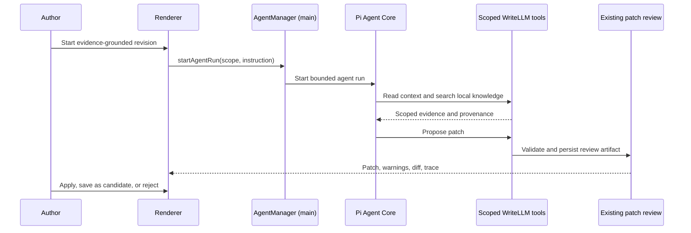
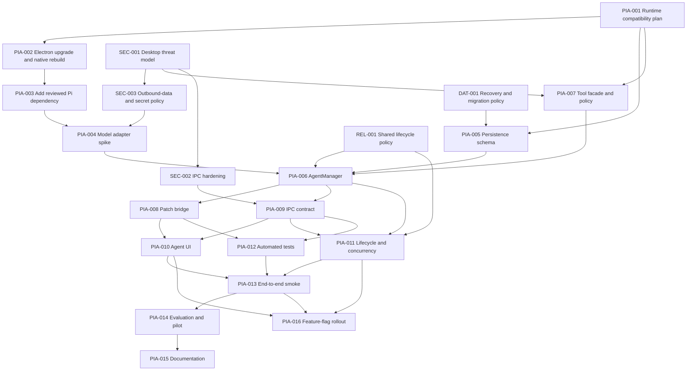

# Pi Agent Harness Initiative PRD

## 1. Purpose and agent operating contract

This is a scoped initiative PRD for introducing [Pi](https://github.com/earendil-works/pi) into WriteLLM as a controlled writing-agent runtime. The [WriteLLM Master Product PRD](project-prd.md) owns whole-product scope and the [project task tracker](task-tracker.md) owns all live PIA task status, ownership, dates, blockers, and evidence.

Future coding agents working on this initiative must:

1. Read the master PRD, task tracker, this initiative PRD, and linked ADRs before making a Pi-related change.
2. Check the dependency graph and task-to-ADR mapping here, then select a READY task only from the global tracker.
3. Claim, update, block, review, and complete the task only in the global tracker; do not add a second status or activity log here.
4. Keep changes inside the claimed task's scope; create a decision or follow-up task instead of silently expanding scope.
5. Record implementation evidence, tests, and remaining risk in the global tracker before a task can be marked DONE.
6. Never mark a task complete solely because code compiles; every task must meet its listed acceptance criteria.
7. Do not change a requirement, security boundary, or completed task's scope without an ADR entry or update and an affected-task update.

### Task authority and handoff

Use the permanent task ID in branch names, commit messages, PR titles, and handoffs where practical. The [global tracker](task-tracker.md) is the sole source for PIA task state. This document retains immutable work-package scope, acceptance criteria, dependencies, requirement traceability, and parallelization guidance.

## 2. Executive summary

WriteLLM currently provides reliable single-purpose LLM actions: retrieve supporting knowledge, generate a structured patch proposal, validate it, and let the user apply or reject it. Pi should add the missing multi-step orchestration layer for research-intensive work, such as deciding whether evidence is sufficient, running another retrieval pass, reconciling multiple sections, and producing a reviewable revision.

Pi is not the document store, permission system, filesystem layer, or source of truth for version history. WriteLLM retains those responsibilities. Pi is an in-process, main-process agent loop that can call a narrowly scoped set of WriteLLM tools and return a `WritingPatch` for normal human review.

The first shippable outcome is an **evidence-grounded revision agent**: given a focused section or selection and an author instruction, it can inspect context, search the local knowledge base, decide whether it has enough evidence, and produce one existing-style patch. It cannot silently alter a document.

### MVP scope decision

The MVP supports both whole-section and selected-text runs. A selected-text run is always anchored to its parent section; one active-run lock is held per section, so a second run cannot compete with a selection or full-section run for that section.

## 3. Problem statement

The current generation flow is intentionally safe but mostly linear:

```text
prompt → retrieval planning → retrieval → structured proposal → patch validation → human review
```

That is effective for append, continue, and targeted rewrite actions. It is insufficient when a task requires conditional, multi-turn reasoning:

- Compare claims against several local sources before revising a section.
- Notice a missing evidence gap and formulate a second retrieval query.
- Check whether a proposed rewrite conflicts with a project brief, outline, or another section.
- Explain why an evidence-backed edit should be reviewed rather than applied.

Prompt stitching alone makes these workflows difficult to observe, cancel, evaluate, and extend. A harness with typed tools and a durable execution trace gives WriteLLM a reusable foundation without sacrificing the existing review boundary.

## 4. Product goals

### Goals

1. Add a safe, observable multi-step agent runtime to WriteLLM.
2. Preserve the existing `WritingPatch` review, validation, and Git checkpoint workflow as the only path to persistent document mutations.
3. Let agents use WriteLLM's local article structure and knowledge retrieval as typed, scoped tools.
4. Make agent work understandable to an author through a streamed trace of reasoning stages, tool calls, evidence, and proposed output.
5. Keep provider credentials, workspace data, and agent permissions inside the Electron main process.
6. Establish a task structure that permits independent implementation agents to work in parallel with explicit dependencies.

### Non-goals for the first release

- A general-purpose computer-use or coding agent.
- Shell, arbitrary filesystem, arbitrary Git, arbitrary network, or package-installation tools.
- Automatic application of document, outline, setting, or knowledge-base changes.
- Loading user-installed or marketplace Pi extensions.
- Replacing existing quick generation actions or the current Vercel AI SDK path for them.
- Automatic web research; the initial agent uses only the local WriteLLM knowledge base.
- Guaranteed factual correctness or autonomous citation verification beyond the evidence and validation tools supplied by WriteLLM.

## 5. Product scope and primary user story

### Primary user story: evidence-grounded revision

> As an academic writer, I select a section or passage and ask the writing agent to improve it while preserving support from my uploaded sources. I can see what it inspected and retrieved, assess the proposed diff and warnings, then choose whether to apply it.

### Success flow



### Future user stories, outside the MVP

- Cross-section consistency reviewer that creates separate review patches.
- Outline-to-draft workflow with section-level checkpoints.
- Research-gap assistant that returns a plan and source requests, not document changes.
- Author-approved tool packs for additional bounded writing workflows.

## 6. Product and technical context

| Existing capability | Current location | Role after Pi integration |
| --- | --- | --- |
| LLM settings and one-shot streaming | `src/main/llmRunner.ts` | Remains the quick-action path and provides settings for an agent-model adapter. |
| Generation orchestration | `src/main/ipcHandlers.ts` | Continues serving current actions; delegates new agent IPC requests to `AgentManager`. |
| Article/project context | `src/main/generationContext.ts` | Becomes source material for scoped read tools. |
| Retrieval planning and search | `src/main/retrievalPlanner.ts`, `src/main/knowledgeIndex.ts`, `src/main/retrievalWorkerClient.ts` | Becomes evidence tools; must preserve provenance. |
| Patch protocol and validation | `src/main/harness/`, `src/main/generationPatch.ts` | Remains the sole document-change boundary. |
| SQLite workspace and Git history | `src/main/database.ts`, `src/main/gitSession.ts` | Remains the persistent source of truth. |
| Typed IPC boundary | `src/shared/ipc.ts`, `src/preload/preload.cts`, `src/renderer/api.ts` | Exposes typed agent commands and event subscription. |
| Review UI | `src/renderer/features/generation/GenerationHub.tsx` | Reuse or extend for agent trace and patch review. |

### Pi integration boundary

Use `@earendil-works/pi-agent-core`, not the Pi coding-agent CLI. The integration belongs only in the Electron main process. Renderer code must never import Pi, hold provider credentials, or receive direct access to database/filesystem services.

```text
Renderer → typed IPC → AgentManager → Pi Agent Core → WriteLLM tool facade
                                                    ├─ article/context reads
                                                    ├─ local knowledge retrieval
                                                    ├─ citation/coverage inspection
                                                    └─ patch proposal only

Pi output → existing WritingPatch validation → human review → existing apply/checkpoint path
```

## 7. Requirements

### 7.1 Functional requirements

| ID | Priority | Requirement | Acceptance criteria |
| --- | --- | --- | --- |
| `PIA-FR-001` | Must | The author can start an agent run for a scoped section or selected text, with an explicit instruction and an agent mode. | Invalid workspace, section, selection, or blank instruction is rejected before an LLM call; the created run has a stable ID and requested scope; a selected-text run retains its parent section ID. |
| `PIA-FR-002` | Must | The main process owns the Pi agent lifecycle, including start, stream, cancellation, timeout, and cleanup. | A run emits ordered lifecycle events; MVP tool calls execute sequentially; cancellation stops model/tool work using an abort signal; workspace switch or app shutdown cannot leave a run writing to a closed workspace. |
| `PIA-FR-003` | Must | Each turn receives only bounded, relevant context: project brief, focused section snapshot/hash, selected range when applicable, and explicitly retrieved evidence. | The agent does not receive an implicit full-workspace dump; context source IDs and truncation are visible in the trace. |
| `PIA-FR-004` | Must | The agent can call only an allowlisted WriteLLM tool registry. | Available MVP tools are exactly `get_article_context`, `read_section_snapshot`, `search_knowledge`, `resolve_citation`, `inspect_citation_coverage`, and `propose_patch`; absent tools cannot be invoked. |
| `PIA-FR-005` | Must | `search_knowledge` uses existing local retrieval and returns source provenance sufficient for citation review. | Tool results retain item/chunk IDs, public references, titles, snippets, and retrieval reason; the run stores an evidence manifest; failed or canceled retrieval is shown as a tool failure, not fabricated evidence. |
| `PIA-FR-006` | Must | The only output that can affect document content is a typed patch proposal that reuses existing patch validation. | The agent cannot call `updateSectionMarkdown`, `acceptWritingPatch`, database methods, or filesystem APIs; a proposal has anchors, diff, validation result, and provenance. |
| `PIA-FR-007` | Must | The author can inspect the final response, tool trace, evidence, patch diff, and warnings before choosing Apply, Save as Candidate, or Reject. | Existing high-risk confirmation behavior remains intact; no successful run directly changes section Markdown. |
| `PIA-FR-008` | Must | WriteLLM persists an auditable agent session, run, and tool-event trace in its workspace database. | Completed and failed run history is available after app restart; no API key, bearer token, or unredacted secret is stored in the trace. |
| `PIA-FR-009` | Should | The author can steer a live run or queue a follow-up prompt without opening a second concurrent run for the same section. | Steer/follow-up is visibly queued and delivered at a safe turn boundary; unsupported run states return a typed error. |
| `PIA-FR-010` | Must | A failed or exhausted run produces a clear terminal state and a safe retry path. | UI distinguishes cancellation, budget exhaustion, model error, tool error, and validation failure; retry does not reapply or duplicate a patch. |
| `PIA-FR-011` | Should | The system exposes model capability status before starting an agent run. | A model/endpoint that cannot support the required tool-calling mode is disabled for agent mode with a useful explanation; quick actions remain available. |
| `PIA-FR-012` | Should | Agent runs can be listed by workspace and section separately from legacy generation rounds. | Historical agent work is filterable and does not overload retrieval-only trace types or legacy session semantics. |
| `PIA-FR-013` | Must | An agent patch records which run-visible evidence supports its new or modified citations and claims. | The patch metadata contains the run ID and evidence manifest references; an unresolvable newly introduced citation is blocked or surfaced as a blocking review issue in the MVP. |
| `PIA-FR-014` | Must | Agent mode is protected by a local feature flag and a safe rollback path. | The feature can be disabled without changing the legacy generation flow; disabled state prevents new agent runs but leaves historical traces readable. |

### 7.2 Non-functional requirements

| ID | Priority | Requirement | Acceptance criteria |
| --- | --- | --- | --- |
| `PIA-NFR-001` | Must | Enforce least privilege at the product boundary. | No raw shell, arbitrary path, raw Git, browser, external HTTP, plugin loader, or arbitrary database tool is registered in the MVP. |
| `PIA-NFR-002` | Must | Treat author prompts, section Markdown, and ingested sources as untrusted data. | System/tool prompts say sources are evidence rather than instructions; source text cannot alter the registered tool set, permission policy, or approval boundary. |
| `PIA-NFR-003` | Must | Maintain document integrity under concurrent editing. | Each patch uses current section anchors/hashes; stale patches fail or warn through the existing validator; only one active run exists per section. |
| `PIA-NFR-004` | Must | Bound cost and latency. | MVP defaults are configurable and enforced: maximum 6 LLM turns, 2 knowledge-search calls, 8 total tool calls, one active run per section, 120 seconds wall-clock time, and model/output token limits. Terminal traces state which budget ended a run. |
| `PIA-NFR-005` | Must | Preserve privacy and secret hygiene. | API keys stay in the main process; telemetry is local by default; logs/trace views redact secrets and cap source text retained in UI events. |
| `PIA-NFR-006` | Must | Be testable without live provider credentials. | Unit tests use a deterministic fake stream/tool adapter; coverage includes tool denial, cancellation, stale patch, workspace switch, and trace persistence. |
| `PIA-NFR-007` | Should | Make operational state understandable. | The UI distinguishes planning, retrieving, tool execution, drafting, awaiting review, success, cancellation, and error without exposing hidden chain-of-thought. |
| `PIA-NFR-008` | Should | Isolate the Pi dependency behind a local adapter. | Product code outside `src/main/agent/` does not depend directly on Pi message/event types; an adapter owns version-specific conversions. |

## 8. Security, permission, and data policy

Pi does not supply WriteLLM's permission model. The product must define and enforce it before every tool call. In the MVP, the simplest safe policy is to make all registered agent tools read-only except `propose_patch`, which creates a review artifact rather than a persistent document change.

| Capability | MVP policy | Enforcement point |
| --- | --- | --- |
| Read active article context | Allowed, scoped to active workspace and requested section | `writeLlmTools.ts` input/scope checks |
| Read selected source evidence | Allowed, size-limited and provenance-preserving | Retrieval/result formatter |
| Create patch proposal | Allowed, but no application | Existing `WritingPatch` validator and review UI |
| Apply patch | User-only | Existing `acceptWritingPatch` IPC path |
| Edit documents/nodes/settings directly | Denied | No corresponding agent tool |
| Filesystem/Shell/Git commands | Denied | Do not register Pi built-in tools |
| External HTTP/browser/web research | Denied in MVP | Do not register a network tool |
| Dynamic Pi extensions/packages | Denied | Do not create a resource/extension loader |

### Required safeguards

- Every tool validates parameters with a local schema and checks workspace/section ownership.
- Every tool honors the run's `AbortSignal` and returns bounded output.
- Tool results should return references and excerpts, not entire files or unrestricted database records.
- Agent events must never contain API keys or raw settings objects.
- The system prompt must explicitly instruct the model to treat retrieved content as untrusted evidence, never as tool or policy instructions.
- A future privileged tool requires a separate PRD revision, an author-visible approval flow, threat model, and end-to-end tests.

## 9. Runtime compatibility and dependency policy

### Current compatibility constraint

The prior resolved Electron runtime was 35.7.5 with Node 22.16.0, below Pi Core's `>=22.19.0` engine requirement. ADR-0006 proved the minimum Node-compatible Electron 37.6.0 path but was superseded after the dependency audit found that it was not a suitable release runtime. ADR-0010 selects and PIA-017 verifies exact Electron 40.10.5 with embedded Node 24.15.0 and exact better-sqlite3 12.11.1. Pi Core 0.80.3 is now installed only on that verified runtime.

### Required dependency policy

1. Keep Electron exact at 40.10.5 unless a later ADR supersedes it; its embedded Node 24.15.0 meets Pi's declared engine requirement.
2. Keep better-sqlite3 exact at 12.11.1, rebuild it, and smoke-test it for each Electron update.
3. Add `@earendil-works/pi-agent-core` and any direct Pi dependency at an exact reviewed version, not a floating range.
4. Record the selected version, its license, transitive dependency review, and build/package result in task evidence.
5. Do not use deprecated `@mariozechner/*` packages for production. An old version may only be used in a time-boxed local spike, never as the release dependency.

### Model adapter decision gate

Agent mode must preserve existing user-configured providers where feasible. Before implementation, complete a short spike that chooses one of these approaches:

- **Native Pi AI adapter:** map WriteLLM settings to Pi's provider/model configuration.
- **Custom Pi stream adapter:** retain the Vercel AI SDK transport and translate its stream/messages to Pi's agent interface.

The selected approach must support tool calls, cancellation, token/output limits, user-supplied compatible endpoints, and test doubles. Do not migrate existing quick-generation functionality as part of this decision.

## 10. Proposed architecture and contracts

### Main-process modules

| Planned module | Responsibility |
| --- | --- |
| `src/main/agent/agentManager.ts` | Own active-run registry, Pi lifecycle, budgets, cancellation, workspace lifecycle, and event publishing. |
| `src/main/agent/modelAdapter.ts` | Isolate Pi/provider/version-specific model and stream conversion. |
| `src/main/agent/writeLlmTools.ts` | Declare the allowlisted tool schemas and call scoped existing services; never expose raw database objects. |
| `src/main/agent/agentPersistence.ts` | Persist sessions, runs, event summaries, tool calls, and redacted usage metadata. |
| `src/main/agent/agentPolicy.ts` | Define budgets, tool policy, redaction, and error classification. |

### Shared IPC additions

The exact type names may evolve, but the contract must include equivalents of:

```ts
startAgentRun(payload) -> { runId, sessionId, status }
cancelAgentRun(runId) -> AgentRunRecord
steerAgentRun({ runId, message }) -> void
followUpAgentRun({ runId, message }) -> void
getAgentRun(runId) -> AgentRunRecord | null
listAgentSessions(sectionId?) -> AgentSessionRecord[]
listAgentRuns(sessionId) -> AgentRunRecord[]
onAgentEvent(callback) -> unsubscribe
```

Add each channel consistently in `src/shared/ipc.ts`, `src/preload/preload.cts`, and `src/renderer/api.ts`. Events must be UI-safe summaries, not raw provider objects or arbitrary tool payloads.

### Persistence model

Use a new set of agent-specific records rather than extending `retrievalTrace` or pretending every agent run is a legacy generation round.

| Record | Minimum contents | Retention / safety rule |
| --- | --- | --- |
| `agent_sessions` | ID, workspace/section scope, title, timestamps, model identity, compacted context metadata | Local workspace database; no credential fields. |
| `agent_runs` | ID, session ID, status, intent, budgets, terminal reason, timing, final patch ID, evidence manifest references | One row per execution/retry; supports audit and retry. |
| `agent_events` | Sequence, event kind, user-safe summary, timestamp | Redact/cap source/tool output; never store chain-of-thought. |
| `agent_tool_calls` | Tool name, validated input summary, result summary, status, duration, provenance refs | Store references/metrics instead of unbounded source text. |

An in-flight run is not resumable in the MVP. On restart or workspace switch it becomes terminal/canceled, while its completed trace remains inspectable. Durable context resumption is a later product decision.

## 11. UX requirements

### Agent panel

The renderer should extend the existing generation/review experience rather than introduce a disconnected chat product. It must show:

- The author instruction, target scope, run status, and cancel action.
- A concise event timeline: planning, context read, retrieval, tool activity, drafting, proposed patch, terminal state.
- Evidence sources with title/public reference and a way to open the existing citation target.
- The existing patch diff, validation warnings, Apply, Save as Candidate, and Reject controls.
- Clear budget/exhaustion and error messages.
- A steering/follow-up control only while supported by the current run state.

### UX constraints

- Do not display hidden model reasoning or imply that source retrieval proves a claim.
- Do not make an Apply button appear as an agent action; it is always an author decision.
- Do not present unsupported provider/tool capability as a generic failure after a long run; explain it before start.
- Preserve keyboard access, screen-reader labels, and existing error/toast patterns.

## 12. Success metrics and evaluation

### Release gates

| Gate | Target |
| --- | --- |
| Document safety | 100% of automated agent-run tests confirm that no run directly changes section Markdown before author approval. |
| Permission safety | 100% of tool-policy tests deny shell, unrestricted filesystem, network, settings, and direct-apply attempts. |
| Trace integrity | 100% of terminal test runs persist a terminal status and redacted event trace. |
| Cancellation | Cancellation ends active model/tool work within the configured timeout and leaves no patch applied. |
| Evidence provenance | Every source shown in an agent-generated patch trace maps to an existing knowledge item/chunk reference. |
| Pilot usefulness | A labeled internal task set demonstrates that the agent completes evidence-grounded revision flows at least as reliably as the existing manual multi-step workflow; establish the numerical threshold during the evaluation task. |

### Evaluation corpus

Before release, create a small fixture corpus covering:

- A straightforward supported rewrite.
- A query that needs a second retrieval pass.
- Insufficient evidence that should end with a warning/no patch.
- A source containing instruction-like text.
- A stale patch after concurrent section editing.
- Tool/model failure and user cancellation.

The corpus must use synthetic or approved test content and run without live provider credentials wherever possible.

## 13. Delivery plan and phase gates

| Phase | Outcome | Exit gate |
| --- | --- | --- |
| 0 — Compatibility and design | A supported Electron/Pi runtime and an approved model-adapter design | Electron/native smoke passes; adapter decision recorded. |
| 1 — Safe runtime foundation | Agent lifecycle, persistence, event contract, and tool policy | Deterministic tests show bounded, cancellable, no-write execution. |
| 2 — Evidence-grounded vertical slice | Author can run one scoped evidence-backed revision and review its patch | End-to-end test and manual smoke pass with no direct mutation. |
| 3 — Hardening and pilot | Evaluation corpus, error UX, observability, documentation | Release gates in Section 12 pass. |
| 4 — Expansion | Cross-section or outline workflows | Separate PRD amendment and threat review approved. |

## 14. Dependency graph



## 15. Implementation work packages

The [global task tracker](task-tracker.md) is authoritative for current owner, status, dates, blocker, and evidence for every PIA task. This table is a stable work-package decomposition: it defines scope, dependencies, and acceptance criteria but must not be used as a second live task board.

| ID | Phase | Workstream | Work package | Dependencies | Acceptance criteria / evidence |
| --- | --- | --- | --- | --- | --- |
| PIA-001 | 0 | Architecture | Confirm exact Electron, Node, Pi, native-module compatibility, feature flag, and rollback plan; record selected target versions and upgrade risk. | — | Decision record has exact versions, rollout flag, upgrade/rebuild/test, and rollback plan. |
| PIA-002 | 0 | Platform | Upgrade Electron to the selected compatible line and rebuild better-sqlite3. | PIA-001 | Bun typecheck, build, native rebuild, and Electron smoke pass on target runtime. |
| PIA-003 | 0 | Dependencies | Add exact reviewed Pi Core dependency and document direct/transitive dependency review. | PIA-002 | Lockfile diff reviewed; package loads from Electron main build; no coding-agent CLI/extension loader added. |
| PIA-004 | 0 | Model | Spike and select a Pi model/stream adapter that preserves current provider settings, cancellation, tool calls, and testability. | PIA-003, SEC-003 | Decision record plus focused proof of one tool-call round with a compatible endpoint or deterministic fake; follow the accepted outbound-data/secret policy. |
| PIA-005 | 1 | Persistence | Define schema/migration and typed records for agent sessions, runs, events, and tool calls. | PIA-001, DAT-001 | Migration is compatible with the accepted recovery policy; records redact secrets; database tests cover create/list/terminal updates. |
| PIA-006 | 1 | Runtime | Implement AgentManager with bounded lifecycle, event sequencing, cancellation, and cleanup. | PIA-004, PIA-005, PIA-007, REL-001 | Deterministic test completes, errors, cancels, and persists terminal run state without direct mutation; follows shared lifecycle policy. |
| PIA-007 | 1 | Security | Implement scoped tool facade, validation, output caps, prompt-injection guidance, and default budgets. | PIA-001, SEC-001 | Only MVP tool list is reachable; policy tests prove forbidden operations cannot be called and comply with desktop threat model. |
| PIA-008 | 2 | Patch integration | Bridge agent output to the existing proposal/patch/validator flow without duplicating write logic. | PIA-006 | Valid proposal yields the same reviewable patch semantics; invalid/stale output is blocked or warned by existing validation. |
| PIA-009 | 1 | IPC | Add shared agent run/event types and all IPC, preload, and renderer API surfaces. | PIA-006, SEC-002 | Typecheck proves contract is wired consistently; renderer cannot access raw main services and IPC hardening is enforced. |
| PIA-010 | 2 | Renderer | Extend generation/review UI with agent timeline, evidence display, patch review, cancellation, and error states. | PIA-008, PIA-009 | Manual UI flow supports start, trace, review, reject/apply, section-busy/steer/follow-up states; keyboard and error states are covered. |
| PIA-011 | 2 | Reliability | Add workspace-switch, shutdown, one-active-run-per-section, timeout, and retry safeguards. | PIA-006, PIA-009, REL-001 | Tests show no run survives against a closed workspace and no duplicate active section run occurs; behavior matches shared lifecycle policy. |
| PIA-012 | 2 | QA | Add deterministic unit/integration tests and fixture scenarios for tool policy, retrieval, cancellation, stale patches, and persistence. | PIA-008, PIA-009 | Tests run without provider credentials and cover all Must requirements. |
| PIA-013 | 3 | QA | Add an Electron smoke scenario for the evidence-grounded vertical slice. | PIA-010, PIA-011, PIA-012 | Smoke test verifies trace, no direct write, and human-reviewed patch lifecycle. |
| PIA-014 | 3 | Product quality | Build the evaluation corpus, run pilot cases, define usefulness threshold, and resolve release blockers. | PIA-013 | Section 12 release-gate evidence is recorded; only non-blocking findings become follow-up tasks, while a Must-requirement gap or P0 blocker keeps this task incomplete. |
| PIA-015 | 3 | Documentation | Update user-facing help and engineering guidance after implementation decisions are stable. | PIA-014 | Documentation matches actual permission model, supported providers, limits, and recovery behavior. |
| PIA-016 | 3 | Release | Implement and rehearse the feature-flag rollout and rollback path. | PIA-010, PIA-011, PIA-013 | Flag disables new runs safely, leaves history readable, and rollback rehearsal evidence is recorded. |
| PIA-017 | 0 | Platform security | Replace a superseded minimum-compatible Electron runtime with the selected supported, patched line and repeat native/runtime verification. | PIA-002 | Exact Electron 40.10.5 / Node 24.15.0 plus better-sqlite3 12.11.1 report native rebuild, typecheck, build, smoke, and direct-Electron-audit clearance before Pi Core dependency proof resumes. |

### Task-to-ADR mapping

The global tracker is authoritative for per-task progress. This matrix identifies which architectural record an implementation agent must read and update when a task changes the design's implementation state.

| PIA task | Related ADRs |
| --- | --- |
| PIA-001 | [ADR-0006](adr/0006-select-supported-electron-pi-runtime-path.md), [ADR-0007](adr/0007-gate-agent-mode-with-a-local-feature-flag.md) |
| PIA-002 | [ADR-0006](adr/0006-select-supported-electron-pi-runtime-path.md) |
| PIA-003 | [ADR-0001](adr/0001-use-pi-agent-core-as-controlled-writing-runtime.md), [ADR-0010](adr/0010-use-a-supported-patched-electron-runtime-for-pi.md) |
| PIA-004 | [ADR-0001](adr/0001-use-pi-agent-core-as-controlled-writing-runtime.md), [ADR-0005](adr/0005-select-pi-model-adapter-strategy.md) |
| PIA-005 | [ADR-0008](adr/0008-persist-agent-audit-traces-in-dedicated-tables.md) |
| PIA-006 | [ADR-0001](adr/0001-use-pi-agent-core-as-controlled-writing-runtime.md), [ADR-0002](adr/0002-run-agent-only-in-electron-main-process.md), [ADR-0005](adr/0005-select-pi-model-adapter-strategy.md), [ADR-0008](adr/0008-persist-agent-audit-traces-in-dedicated-tables.md), [ADR-0009](adr/0009-use-section-level-agent-run-locks.md) |
| PIA-007 | [ADR-0004](adr/0004-limit-mvp-to-an-allowlisted-local-tool-facade.md) |
| PIA-008 | [ADR-0003](adr/0003-preserve-human-reviewed-writingpatch-boundary.md), [ADR-0004](adr/0004-limit-mvp-to-an-allowlisted-local-tool-facade.md) |
| PIA-009 | [ADR-0002](adr/0002-run-agent-only-in-electron-main-process.md), [ADR-0008](adr/0008-persist-agent-audit-traces-in-dedicated-tables.md) |
| PIA-010 | [ADR-0003](adr/0003-preserve-human-reviewed-writingpatch-boundary.md), [ADR-0007](adr/0007-gate-agent-mode-with-a-local-feature-flag.md), [ADR-0009](adr/0009-use-section-level-agent-run-locks.md) |
| PIA-011 | [ADR-0002](adr/0002-run-agent-only-in-electron-main-process.md), [ADR-0008](adr/0008-persist-agent-audit-traces-in-dedicated-tables.md), [ADR-0009](adr/0009-use-section-level-agent-run-locks.md) |
| PIA-012 | [ADR-0002](adr/0002-run-agent-only-in-electron-main-process.md), [ADR-0003](adr/0003-preserve-human-reviewed-writingpatch-boundary.md), [ADR-0004](adr/0004-limit-mvp-to-an-allowlisted-local-tool-facade.md), [ADR-0005](adr/0005-select-pi-model-adapter-strategy.md), [ADR-0008](adr/0008-persist-agent-audit-traces-in-dedicated-tables.md), [ADR-0009](adr/0009-use-section-level-agent-run-locks.md) |
| PIA-013 | [ADR-0003](adr/0003-preserve-human-reviewed-writingpatch-boundary.md) |
| PIA-014 | [ADR-0003](adr/0003-preserve-human-reviewed-writingpatch-boundary.md), [ADR-0004](adr/0004-limit-mvp-to-an-allowlisted-local-tool-facade.md) |
| PIA-015 | [ADR index](adr/README.md) |
| PIA-016 | [ADR-0010](adr/0010-use-a-supported-patched-electron-runtime-for-pi.md), [ADR-0007](adr/0007-gate-agent-mode-with-a-local-feature-flag.md) |
| PIA-017 | [ADR-0010](adr/0010-use-a-supported-patched-electron-runtime-for-pi.md) |

### Suggested parallel assignment batches

| Batch | Tasks that may run in parallel | Coordination rule |
| --- | --- | --- |
| A | PIA-001 only | Runtime decision blocks package work. |
| B | PIA-002, PIA-005, PIA-007 | These can proceed independently after PIA-001 and their respective DAT-001 or SEC-001 gates; do not assume Pi APIs until PIA-003/PIA-004. |
| C | PIA-004, then PIA-006 | PIA-004 also requires SEC-003; start PIA-006 only after PIA-004, PIA-005, PIA-007, and REL-001 are complete. |
| D | PIA-008, PIA-009 | PIA-008 follows PIA-006; PIA-009 additionally requires SEC-002. Coordinate patch and IPC contracts once both are ready. |
| E | PIA-010, PIA-011, PIA-012 | Start after their respective PIA-008/PIA-009 and REL-001 dependencies; UI, lifecycle, and test work may then proceed in parallel. |
| F | PIA-013 | Smoke work begins only after PIA-010, PIA-011, and PIA-012. |
| G | PIA-014, PIA-016 | Both follow PIA-013; PIA-016 also inherits the completed PIA-010 and PIA-011 safeguards. |
| H | PIA-015 | Documentation follows completed evaluation/pilot work in PIA-014. |

### Requirement-to-task traceability

Use this matrix to keep implementation work tied to product requirements. A task may not be closed if one of its mapped Must requirements lacks evidence.

| Requirement | Primary tasks | Required release evidence |
| --- | --- | --- |
| PIA-FR-001 | PIA-006, PIA-009, PIA-010 | Scoped-start validation and parent-section identity test for both section and selection runs. |
| PIA-FR-002 | PIA-006, PIA-011 | Ordered lifecycle events, cancellation, shutdown, and workspace-switch tests. |
| PIA-FR-003 | PIA-004, PIA-006, PIA-010 | Bounded-context source/truncation trace and relevant-context tests. |
| PIA-FR-004 | PIA-007, PIA-012 | Exact allowlist, schema, and forbidden-tool denial tests. |
| PIA-FR-005 | PIA-007, PIA-012 | Local retrieval provenance, failed/cancelled retrieval, and evidence-manifest tests. |
| PIA-FR-006 | PIA-008, PIA-010, PIA-013 | Proposal-only output, validator behavior, and no-direct-write smoke evidence. |
| PIA-FR-007 | PIA-008, PIA-010, PIA-013 | Patch review, warnings, author Apply/Save/Reject, and high-risk confirmation evidence. |
| PIA-FR-008 | PIA-005, PIA-006, PIA-009, PIA-012 | Redacted session/run/event/tool persistence across restart. |
| PIA-FR-009 | PIA-006, PIA-009, PIA-010, PIA-011, PIA-012 | Steer/follow-up state, queue boundary, and section-lock conflict tests. |
| PIA-FR-010 | PIA-006, PIA-011, PIA-012 | Distinct terminal reason, retry, and no-duplicate-patch evidence. |
| PIA-FR-011 | PIA-004, PIA-012 | Capability preflight and unsupported-provider behavior before run start. |
| PIA-FR-012 | PIA-005, PIA-006, PIA-009, PIA-010, PIA-012 | Filterable agent session/run history separate from legacy records. |
| PIA-FR-013 | PIA-007, PIA-008, PIA-012 | Evidence manifest and unresolvable-citation blocking/review tests. |
| PIA-FR-014 | PIA-001, PIA-016 | Local feature-flag and rollback rehearsal evidence. |
| PIA-NFR-001 | PIA-007, PIA-008, PIA-012 | Least-privilege tool-policy and no-direct-mutation tests. |
| PIA-NFR-002 | PIA-007, PIA-012 | Prompt-injection fixture and source-as-evidence policy tests. |
| PIA-NFR-003 | PIA-008, PIA-011, PIA-012 | Section-level lock, stale-patch, and concurrent-edit tests. |
| PIA-NFR-004 | PIA-006, PIA-007, PIA-011, PIA-012 | Turn/search/tool/time budget enforcement and terminal-budget trace. |
| PIA-NFR-005 | PIA-005, PIA-007, PIA-012 | Secret redaction, local telemetry, and bounded UI-event evidence. |
| PIA-NFR-006 | PIA-004, PIA-012 | Deterministic fake adapter and credential-free fixture coverage. |
| PIA-NFR-007 | PIA-009, PIA-010, PIA-012 | Accessible, user-safe operational state and error UI evidence. |
| PIA-NFR-008 | PIA-003, PIA-004, PIA-005, PIA-006, PIA-009, PIA-012 | Pi types isolated behind adapter/runtime boundaries. |

## 16. Decisions and open questions

### Decision links

The [ADR register](adr/README.md) is the only authority for decision rationale, alternatives, dependencies, and decision/implementation status. The references below exist only to connect this initiative's requirements and tasks to their canonical ADR.

| Decision reference | Canonical ADR |
| --- | --- |
| PIA-D-001 | [ADR-0001](adr/0001-use-pi-agent-core-as-controlled-writing-runtime.md) |
| PIA-D-002 | [ADR-0002](adr/0002-run-agent-only-in-electron-main-process.md) |
| PIA-D-003 | [ADR-0003](adr/0003-preserve-human-reviewed-writingpatch-boundary.md) |
| PIA-D-004 | [ADR-0004](adr/0004-limit-mvp-to-an-allowlisted-local-tool-facade.md) |
| PIA-D-005 | [ADR-0005](adr/0005-select-pi-model-adapter-strategy.md) |
| PIA-D-006 | [ADR-0010](adr/0010-use-a-supported-patched-electron-runtime-for-pi.md) (supersedes [ADR-0006](adr/0006-select-supported-electron-pi-runtime-path.md)) |
| PIA-D-007 | [ADR-0007](adr/0007-gate-agent-mode-with-a-local-feature-flag.md) |
| PIA-D-008 | [ADR-0008](adr/0008-persist-agent-audit-traces-in-dedicated-tables.md) |
| PIA-D-009 | [ADR-0009](adr/0009-use-section-level-agent-run-locks.md) |

### Open questions

1. Which configured user endpoints reliably support tool calls, and how should unsupported models appear in Settings?
2. Should agent transcripts be editable/branchable, or only auditable during the MVP?
3. What user-facing budget controls are appropriate before exposing token/cost estimates?
4. What selection-size limits and stale-selection recovery UX are needed for the accepted section-and-selection MVP scope?
5. What evidence threshold should cause an agent to return a research-gap response instead of a patch?
6. When, if ever, should an author be allowed to enable an external web-research tool?

## 17. Verification checklist for a completed vertical slice

- [ ] Electron/Pi runtime compatibility is proven on supported development and packaged-like builds.
- [ ] Pi is imported only by main-process agent modules.
- [ ] No Pi coding-agent CLI, built-in shell/filesystem tools, or dynamic extensions are loaded.
- [ ] An agent run can read scoped article context and retrieve local knowledge.
- [ ] A successful run creates only a reviewable patch, never a direct document write.
- [ ] Patch anchor, citation, number, Markdown, and LaTeX validation continue to run.
- [ ] Apply still requires author action and retains high-risk confirmation behavior.
- [ ] Cancel, timeout, provider failure, tool failure, and workspace switch have tested terminal states.
- [ ] Run and tool traces persist without credentials or hidden reasoning.
- [ ] Typecheck, deterministic tests, and Electron smoke tests pass.

## 18. Reference material

- Pi repository: <https://github.com/earendil-works/pi>
- Pi Agent Core: <https://github.com/earendil-works/pi/tree/main/packages/agent>
- Pi package migration: <https://pi.dev/news/2026/5/7/pi-has-a-new-home>
- Pi Agent Core package engine requirement: <https://raw.githubusercontent.com/earendil-works/pi/main/packages/agent/package.json>
- Electron version/runtime reference: <https://releases.electronjs.org/release/compare/v37.1.0/v37.6.0>
