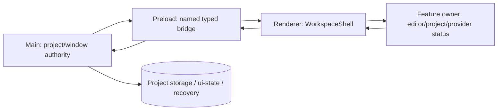

# Implementation Plan: 写作工作台外壳

**Branch**: `002-workspace-shell` | **Date**: 2026-07-12 | **Spec**: [spec.md](./spec.md)

**Input**: Feature specification from `/specs/002-workspace-shell/spec.md`

## Summary

本 feature 为已打开项目建立一个持续存在的 Electron + React 工作台外壳：顶部项目导航、左侧工具入口、中心编辑内容槽位、底部状态区域，以及统一的工具面板、模态、焦点、Escape、外部点击、背景滚动和窄窗口规则。它只负责共享交互边界，不实现章节、资料、AI、引用、历史或 provider 业务。

当前仓库只有 startup foundation：Electron 主窗口已经有安全配置和 1200×800 / 最小 960×640 的窗口约束，preload 只暴露 `getRuntimeInfo`，renderer 只有基础状态页。计划新增的 shell 必须在这个基础上演进，不能从 `legacy/v1-freeze` 复制产品代码、持久化模型、IPC 或组件。

本版是高可行性方案，不拍板库、包或平台能力。研究文档列出候选；所有跨边界技术选型、版本策略和持久化策略均保持 `Decision: NEEDS DECISION`，实现前须由维护者在 checklist 中确认。

## Technical Context

**Language/Version**: TypeScript 5.8.2；React/React DOM 19；Electron 40.10.5；Bun 1.3.4（包管理器和测试运行器）；Vite 6.2.2。以上是当前 `package.json` 的已有栈。

**Primary Dependencies**: 当前仅使用 React、React DOM、Electron、Vite 和 TypeScript。浮层/焦点 primitives、状态库、测试工具和样式方案仅在 [research.md](./research.md) 中作为候选，未批准为依赖。最低可行方案可由 React 内置状态、现有 CSS 和现有 Bun scripts 组成。

**Storage**: 工作台交互状态默认是 renderer 内的短生命周期状态；不直接写文件、Git 或 `localStorage` 作为项目真相。项目 manifest、`ui-state.json`、保存队列、Git 和恢复协议仍由 `001-project-foundation` 与 [ADR-001](../../docs/adr/001-project-storage.md) 的 main-owned 边界管理。是否把面板/布局偏好加入 `ui-state.json` 是 `NEEDS DECISION`，且不能把焦点 DOM 引用、模态打开状态或秘密写入持久化。

**Testing**: 当前已有 `bun test`、`bun run typecheck`、`bun run build` 和 `bun run test:smoke`。计划在不改变现有脚本语义的前提下增加 shell 状态/语义测试和真实 Electron runtime smoke；React Testing Library、Playwright Electron 或其他工具的加入是候选而非批准依赖。跨进程行为必须在 Electron runtime 或等价 runtime-level 环境验证。

**Target Platform**: Electron 40.10.5 单窗口桌面应用，面向 macOS、Windows 和 Linux；当前窗口默认 1200×800，最小 960×640。Linux Wayland 对程序化窗口大小/位置可能有限制，不能把 renderer CSS 的响应式能力误认为原生窗口 API 能力。

**Project Type**: 安全桌面应用（Electron main + preload + React renderer）。

**Performance Goals**: 面板打开、切换和关闭不得重建主要编辑区域；必须保持内容、选区和滚动位置。现有 spec 要求 100 次切换 100% 不丢失编辑上下文（Spec §SC-002），并在 960×640 仍可访问主要编辑区和保存错误入口（Spec §SC-005）。具体首屏、面板切换和状态更新时间阈值尚未给出，为 `NEEDS DECISION`，不能自行追加未经接受的硬性 SLA。

**Constraints**:

- Renderer 继续视为不可信边界，保持 `contextIsolation: true`、`nodeIntegration: false`、`sandbox: true` 和 `webSecurity: true`。
- preload 只允许逐项映射命名、typed IPC；不暴露 generic IPC、文件系统、任意路径、Node 对象或任意函数。
- main 负责窗口、文件、项目和输入验证；shell 只消费安全 DTO、派发有限 UI 事件并呈现安全错误摘要。
- 同时最多一个活动工具面板；模态打开时背景不可误操作，关闭后焦点有明确恢复规则。
- 面板接入必须是可替换的 feature slot，不把下游业务逻辑倒灌到 shell。
- 首版不依赖外部 provider、远程 worker、账号、凭据、网络同步或多窗口。

**Scale/Scope**: 单作者、单机、本地项目、单 Electron 窗口；四个稳定布局区域；一个活动面板和一个活动模态的最小状态模型。面板数量、具体 feature registration 方式和可持久化布局偏好仍需决策。

### 已有基础与计划新增

| 范围 | 当前 checkout 中已存在 | 本 feature 计划新增或重构 |
|---|---|---|
| Electron 窗口 | `src/main/main.ts` 创建 `BrowserWindow`，安全 webPreferences、1200×800、最小 960×640、导航/外链限制 | 将窗口边界作为 shell 的运行时前提；若要动态改变原生约束，另行冻结 main contract，不让 renderer 直接调用 Electron |
| preload/IPC | `src/preload/preload.cts` 暴露 `getRuntimeInfo`；`src/shared/ipc.ts` 只有 `RuntimeInfo` 与一个 channel | 只在接受依赖 contract 后扩展 typed DTO；shell 不新增 generic bridge |
| renderer | `App.tsx`、`main.tsx`、`styles.css` 的 foundation 状态页 | `WorkspaceShell`、布局区域、面板/模态协调、焦点恢复、状态展示和响应式 CSS；`App.tsx` 改为挂载稳定 shell |
| 持久化/项目 | 当前无项目存储实现；ADR-001 和 001 spec 定义目标边界但均未接受 | shell 只消费 001 的 project/session DTO；是否持久化 shell 偏好留给 ADR/Decision |
| 验证 | `test/smoke/ipc-contract.test.ts` 和 `scripts/electron-smoke.mjs` 只验证 foundation IPC 编译产物 | 添加 renderer 语义/状态验证和真实 Electron 的面板、模态、窗口边界 smoke；不得以静态类型检查替代 runtime 验证 |

## Constitution Check

### Pre-research gate

| Principle | Status | 证据与需要处理的边界 |
|---|---|---|
| I. Secure Desktop Boundary | PASS（设计约束） | renderer 不获得 Node/Electron；窗口和文件能力继续留在 main/preload。当前 foundation 已设置安全 webPreferences。 |
| II. Typed, Minimal IPC | PASS（现有基础，扩展待决） | 当前只有命名的 `getRuntimeInfo`。任何项目摘要、保存状态或重试能力必须进入 shared types 并逐项映射；具体 contract 尚未冻结。 |
| III. Specification-Driven, Minimal Evolution | BLOCKED UNTIL ACCEPTED | `spec.md` 仍为 Draft，ADR-001 仍为 Proposed；本计划不实现代码，且不生成 tasks.md。实现前必须接受 spec、ADR 和跨边界 decisions。 |
| IV. Verification at the Failure Boundary | PASS WITH PLAN | 计划同时包含状态纯逻辑、DOM/a11y、IPC contract 和真实 Electron runtime smoke；需要 fixture 和 runtime harness 决策。 |

**Pre-research conclusion**: 安全和验证方向符合 constitution；产品实现 gate 尚未通过，因为 spec/ADR/跨边界选择尚未被接受。这是当前项目状态，不是 Constitution exception。

## Project Structure

### Documentation (this feature)

```text
specs/002-workspace-shell/
├── plan.md                         # 本规划
├── research.md                     # 候选研究；所有最终选择仍 NEEDS DECISION
├── data-model.md                   # shell 状态、实体、校验和边界
├── quickstart.md                   # 端到端验证场景和运行命令
├── contracts/
│   ├── workspace-shell.md          # renderer 内部 UI contract
│   └── workspace-ipc.md            # renderer↔preload↔main 边界 contract
├── checklists/
│   ├── requirements.md             # 已有 requirements checklist，不覆盖
│   └── plan-decisions.md           # 本次追加的规划决策 checklist
└── tasks.md                        # 本次不生成；由 speckit-tasks 后续生成
```

### Current source tree (真实现状)

```text
src/
├── main/main.ts
├── preload/preload.cts
├── renderer/
│   ├── App.tsx
│   ├── main.tsx
│   └── styles.css
├── shared/ipc.ts
└── vite-env.d.ts

scripts/
├── dev-electron.mjs
└── electron-smoke.mjs

test/smoke/ipc-contract.test.ts
```

### Planned source delta (计划新增，不代表当前文件已存在)

```text
src/
├── main/main.ts                    # 已有；只在接受 contract 后调整窗口集成
├── preload/preload.cts             # 已有；只逐项扩展 typed bridge
├── shared/
│   └── ipc.ts                      # 已有；新增类型必须保持最小、命名、可审查
└── renderer/
    ├── App.tsx                     # 已有；改为装配 project-ready 与 workspace shell
    ├── main.tsx                    # 已有；保持单 root
    ├── styles.css                  # 已有；扩展 layout tokens/响应式规则
    └── workspace/                  # 计划新增
        ├── WorkspaceShell.tsx
        ├── workspaceState.ts       # 纯状态转换；具体状态库未决
        ├── components/
        │   ├── ProjectNav.tsx
        │   ├── ToolRail.tsx
        │   ├── WorkspaceCanvas.tsx
        │   ├── WorkspaceStatusBar.tsx
        │   ├── ToolPanelHost.tsx
        │   └── ModalHost.tsx
        └── focus/
            └── focusRegistry.ts    # 触发入口与关闭后恢复目标

test/
├── smoke/ipc-contract.test.ts      # 已有；保留并扩展最小 contract 断言
├── unit/workspace/                 # 计划新增：状态转换和数据校验
├── integration/workspace/          # 计划新增：DOM 语义、键盘、焦点、状态展示
└── runtime/workspace/              # 计划新增或由选定 runtime harness 承载
```

**Structure Decision**: 保持现有单仓库 Electron + React 分层，不新建 package、renderer app 或服务。shell 代码归 `src/renderer/workspace`；跨进程类型继续归 `src/shared`；main/preload 只承载必要的集成。上面 `workspace/` 和测试目录是实施计划，不是当前源码事实。具体文件名可在 tasks 阶段调整，但不能改变安全分层。

## 分阶段实施顺序

### Phase 0 — 研究与决策输入（本次规划）

1. 记录浮层/焦点、状态编排、样式、测试和 Electron 窗口能力的候选。
2. 以 WAI-ARIA APG、Electron、React、候选库官方文档为研究依据。
3. 明确当前 foundation 与计划新增的差异；不安装依赖、不改 package.json。
4. 产出本目录的 research、data model、contracts、quickstart 和 plan-decisions checklist。

### Phase 1 — 冻结跨边界前提（实现前）

1. 接受 `002-workspace-shell/spec.md`，并确认 `001-project-foundation` 的 project/open/save DTO、错误码和生命周期已可被依赖。
2. 接受或修订 [ADR-001](../../docs/adr/001-project-storage.md)；若 shell 布局偏好、窗口状态或恢复协议跨越 durable boundary，则新增/更新 ADR。
3. 决定浮层/焦点 primitives、状态编排、样式/布局和测试 harness；锁定版本策略、许可审查和 React 19/TypeScript/Bun 兼容性验证方式。
4. 冻结面板标识、模态标识、状态枚举、错误码、DTO 和未知/不支持版本行为。

### Phase 2 — 稳定 shell skeleton（计划新增）

1. 将 `App.tsx` 从 foundation 状态页调整为 project-ready 后挂载 `WorkspaceShell` 的装配层。
2. 建立固定的 top navigation、tool rail、main canvas、status region；main canvas 通过稳定 key/节点身份承载未来编辑器 slot。
3. 用 CSS Grid/Flex 和明确的宽窄模式保证 1200×800 默认窗口及 960×640 最小窗口均有主内容和状态入口。
4. 只放置 placeholder/slot，不实现 003/004/005 的业务。

### Phase 3 — 面板、模态和焦点协调（计划新增）

1. 以受控、可序列化的 `PanelId | null` 保证同一时刻一个活动面板；切换不会卸载主要编辑上下文。
2. 定义 modal open/close、Escape、外部点击、显式关闭、初始焦点和关闭后的返回焦点；modal 背景必须 inert/不可误操作并处理背景滚动。
3. 为每个图标入口提供可访问名称、可见文字或等价提示；键盘路径必须不依赖鼠标。
4. 面板内容由 feature-owned slot 提供，shell 不拥有资料、AI、章节、provider 或历史的业务状态。

### Phase 4 — 状态展示和错误边界（计划新增）

1. 将 project/editor/provider 等 owner 提供的状态映射为 shell 的保存中、已保存、错误、需要处理等可读状态。
2. 状态同时使用文字/语义图标等非颜色信息，重要变化使用合适的 live-region 策略，避免干扰编辑流。
3. 错误展示只使用安全摘要和稳定错误码；重试/恢复事件回到产生该状态的 owner，shell 不绕过 IPC 或直接修改文件。
4. 对 unknown status、external change、recovery required、owner unavailable 等边界保持明确的退化显示。

### Phase 5 — 窗口和运行时集成（计划新增）

1. 保留当前 `BrowserWindow` 安全基线和最小窗口设置；若要运行时调整原生窗口约束，只通过 main-owned named method，并另行冻结 contract。
2. renderer 只根据 viewport 展示布局模式，不持有 Electron `BrowserWindow`、路径或原生对象。
3. 在实际 Electron 中验证 project-ready → shell、IPC 失败、窗口最小尺寸、导航/外链限制和 preload 暴露面。

### Phase 6 — 失败边界验证和交付门槛（计划新增）

1. 运行纯状态转换测试、DOM 语义/键盘/焦点测试和 Electron runtime smoke。
2. 在真实或等价 runtime 中验证 100 次切换不丢内容、选区和滚动；不能只依赖 renderer snapshot。
3. 在 960×640 和默认窗口检查主要入口、错误入口、对话框滚动和可读性。
4. 只有 spec、storage ADR、IPC contract、schema/error code、a11y/performance/recovery decisions 全部可追溯后，才进入 tasks/implementation。

## 跨进程与持久化边界

### 边界规则

| Owner | 允许拥有的能力 | 明确禁止 |
|---|---|---|
| Renderer / workspace shell | ephemeral shell state、DOM 布局、面板/模态交互、可访问状态呈现；通过 `window.writellm` 使用已批准能力 | Node/Electron、文件路径、任意文件读写、Git、secret、generic IPC、直接决定项目保存结果 |
| Preload | 将 shared 中已冻结的命名方法一对一映射给 renderer | 通用 `send/invoke/on` wrapper、任意 channel、把 main 对象或 path 原样泄露给 renderer |
| Main | BrowserWindow、安全策略、项目/文件/Git、输入验证、持久化、结构化安全错误和恢复队列 | 接受未验证 renderer 输入、把 UI library 状态放入 main、把 raw exception/secret 返回 renderer |
| 001 project foundation | 项目身份、open/create/delete/recent、project snapshot、项目级保存/恢复 contract | 被 shell 重新实现；shell 不自行扫描、创建或删除 `.writellm` |
| 003/004/005 等 feature | 自己的动机、大纲、章节、provider 状态和业务错误；以 slot/typed view model 接入 shell | 直接改变 shell 的主编辑上下文、绕过 owner 保存边界 |

### 数据流



当前唯一已实现跨进程方法是 `getRuntimeInfo()`，用于 foundation runtime 状态；shell 不得把它扩大为任意 runtime access。project-ready、保存状态、重试/恢复和窗口能力的精确方法/DTO/错误码必须先在 [contracts/workspace-ipc.md](./contracts/workspace-ipc.md) 与 001 的 contract 中冻结。

### 持久化边界

- 面板是否打开、当前 modal、焦点返回目标、背景滚动锁和布局模式是 session/DOM 状态，默认不持久化。
- 项目身份、项目文件、Git commit、pending transaction 和恢复结果归 main/001/ADR-001；shell 只能接收摘要和安全状态。
- 未来若要保存 rail 折叠、最后活动面板或窗口偏好，必须明确 schema owner、schemaVersion、迁移、损坏恢复、跨项目归属和隐私影响；在此之前留空并标 `NEEDS DECISION`。
- `ui-state.json` 的 canonical 字段由 storage ADR/001 决定；shell 不把 renderer 的 React store 或 DOM ref 序列化进去。
- 不引入外部 provider/worker；本 feature 的离线策略是本地 shell 可展示，状态 owner 不可用时显示安全的需要处理状态。

## Verification Strategy

| Failure boundary | 计划验证 | 关键判定 |
|---|---|---|
| 纯 UI 状态转换 | `PanelId`、modal、focus-return、status/error reducer 的 table/property-style cases | 一个面板、modal 与 panel 冲突规则、关闭后 fallback、未知状态都可预测 |
| Renderer DOM/a11y | 以角色/名称/键盘语义为中心的 integration cases；必要时使用已选的 RTL/user-event 或等价工具 | modal 内 Tab 循环、Escape、外部点击、背景不可操作、焦点回收、图标名称、非颜色状态 |
| 编辑上下文 | 以 fixture editor slot 记录内容、selection、scrollTop，重复切换 100 次 | 100% 保持内容/选区/滚动；主要编辑节点不因面板切换重建 |
| 窗口/响应式 | 实际 Electron 1200×800、960×640；至少覆盖主支持平台；记录 Wayland 限制 | 主编辑区、导航和错误入口仍可达；长背景/modal 内容可读可滚动 |
| IPC/preload | 共享类型、暴露面、错误 DTO 和 compiled preload smoke | 只有命名 typed methods；无 generic channel、path、secret；main 校验输入 |
| Electron runtime | `bun run build` 后 `bun run test:smoke`；若 harness 决定使用 Playwright，再增加真实 Electron launch/interaction | 静态检查不能替代窗口创建、preload、renderer↔main 实际行为 |
| 存储/恢复 | 使用 001 接受后的 temporary project fixture；模拟失败、pending/recovery、外部变更摘要 | shell 不覆盖、不伪装已保存；恢复入口/错误码清晰且不含敏感信息 |

### 现有命令与未决准备

以下命令是仓库已有 scripts，可在实现后使用；本次规划未运行联网安装命令，也未修改 package.json：

```text
bun run typecheck
bun run test
bun run build
bun run test:smoke
bun run dev:electron
```

需要在 implementation 前准备的 fixture/runtime 能力：已接受的 001 project fixture、可重复的 editor context stub、save-status/error event stub、窗口 runtime harness、至少一个可运行的 Electron display 环境，以及最终选定的 DOM/a11y 工具。shell 本身无需外部服务或凭据；provider 真实连通性不属于本 feature。

## Constitution Check（Phase 1 design 后复核）

| Principle | 状态 | 设计复核结论 |
|---|---|---|
| I. Secure Desktop Boundary | PASS WITH ACCEPTANCE CONDITION | shell 保持 renderer-only；所有窗口/存储能力仍在 main。任何新增窗口 IPC 必须在 contract 冻结后实现。 |
| II. Typed, Minimal IPC | PASS WITH ACCEPTANCE CONDITION | 只允许 `getRuntimeInfo` 和未来明确列出的 named methods；DTO/error 不能含 absolute path、secret 或 raw exception。 |
| III. Specification-Driven, Minimal Evolution | NOT YET SATISFIED | 设计材料已生成，但 `spec.md`、ADR-001、001 dependency contract 及本 checklist 的 decisions 尚未接受；因此不能进入实现。 |
| IV. Verification at the Failure Boundary | PASS WITH ACCEPTANCE CONDITION | 方案包含 renderer、IPC、Electron runtime 和存储恢复四层验证；fixture/harness/性能阈值仍需决定。 |

**Post-design gate**: 设计可以进入 review，但不能视为 implementation-ready。`Decision: NEEDS DECISION` 的条目必须在实现任务生成前被明确接受、拒绝或拆分，并在相应 ADR/contract/spec section 记录。

## Complexity Tracking

没有申请 Constitution exception。候选库、额外测试 harness、持久化 shell 偏好和动态窗口 IPC 都是未决事项，不应在未批准前增加复杂度；如后续选择导致违反最小演进原则，必须在此表登记理由和被拒绝的更简单替代方案。

| Candidate complexity | 当前处理 | 需要的决策 |
|---|---|---|
| Accessible overlay/focus library | 只研究，不添加依赖 | `plan-decisions.md` 的候选与版本策略项 |
| Global state library/state machine | 先保持可由 React built-ins 实现 | 复杂度是否由持久状态/异步保存真实需要证明 |
| UI preference persistence | 默认不持久化 | ADR、schema、迁移和恢复边界 |
| Electron runtime harness | 保留现有 smoke；候选工具另行评估 | 真实窗口/a11y/CI 平台覆盖 |
